# Plan de refactoring — Découpage SRP + DRY

> Propose un découpage cohérent pour chaque microservice, avec diagrammes de classes
> et de fichiers. Utilise la composition en priorité, l'héritage uniquement quand
> une relation "est-un" est justifiée.

---

## Vue d'ensemble

Le projet présente deux types de violations :

1. **God objects** : un module/fichier cumule orchestration, état, persistance, réseau
   et logique métier (surtout backend Rust et contextes React).
2. **Duplication silencieuse** : la gestion SSE, le parsing JSON, la gestion d'erreur
   HTTP sont réécrits dans chaque service/hook sans abstraction partagée.

Principe directeur : **composition over inheritance**. Dans ce projet TypeScript/React
et Rust, l'héritage de classe est rare et souvent anti-pattern. On préfère :
- des hooks qui composent d'autres hooks (React)
- des traits + implémentations concrètes (Rust)
- des fonctions utilitaires pures partagées (DRY)

---

## 1. Backend Rust — `neon-beat-back`

### 1.1 État actuel (God modules)

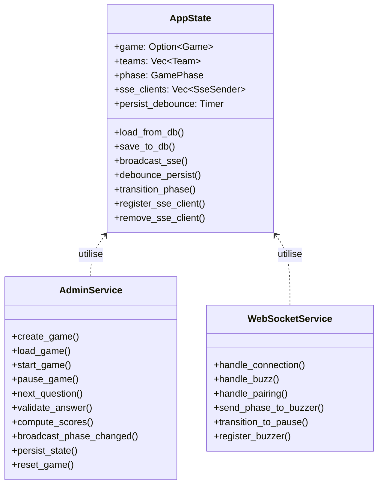

### 1.2 Découpage proposé

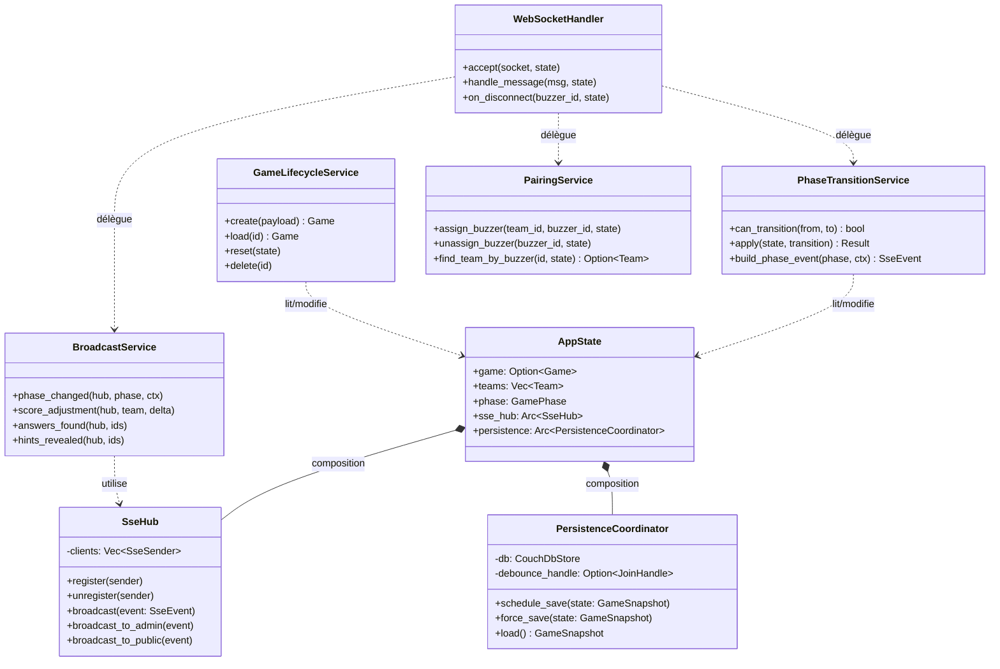

### 1.3 Structure de fichiers proposée

```
src/
├── state/
│   ├── mod.rs              — AppState (struct + new())
│   ├── sse_hub.rs          — SseHub : register / broadcast
│   └── persistence.rs      — PersistenceCoordinator : debounce + save/load
│
├── services/
│   ├── phase_transition.rs — Transitions d'état machine (pure logic)
│   ├── game_lifecycle.rs   — CRUD jeux (create/load/reset/delete)
│   ├── broadcast.rs        — Construction + envoi d'événements SSE
│   ├── pairing.rs          — Logique buzzer-équipe
│   └── websocket.rs        — Handler WebSocket (accept + dispatch)
│
├── routes/
│   ├── admin.rs            — Routing HTTP uniquement (pas de logique métier)
│   └── public.rs
│
└── domain/
    ├── game.rs             — structs Game, Team, Question, Answer
    ├── phase.rs            — enum GamePhase + StateMachine
    └── events.rs           — structs SseEvent, WsMessage (types purs)
```

### 1.4 Trait partagé pour les services (héritage via trait Rust)

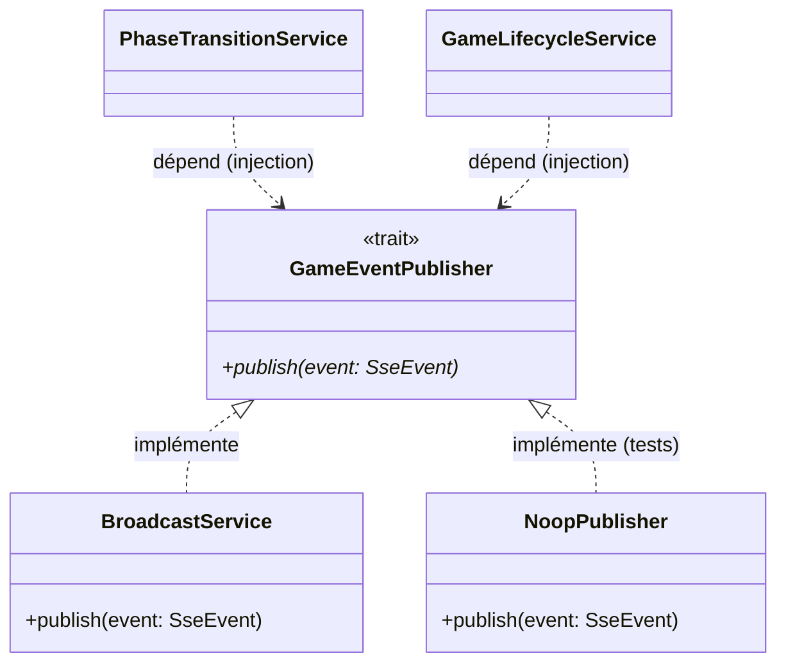

`PhaseTransitionService` et `GameLifecycleService` dépendent du trait
`GameEventPublisher`, pas de l'implémentation concrète. En tests, on injecte
`NoopPublisher` sans avoir besoin d'un vrai SSE.

---

## 2. Admin Front — `neon-beat-admin-front`

### 2.1 État actuel — Contextes surchargés

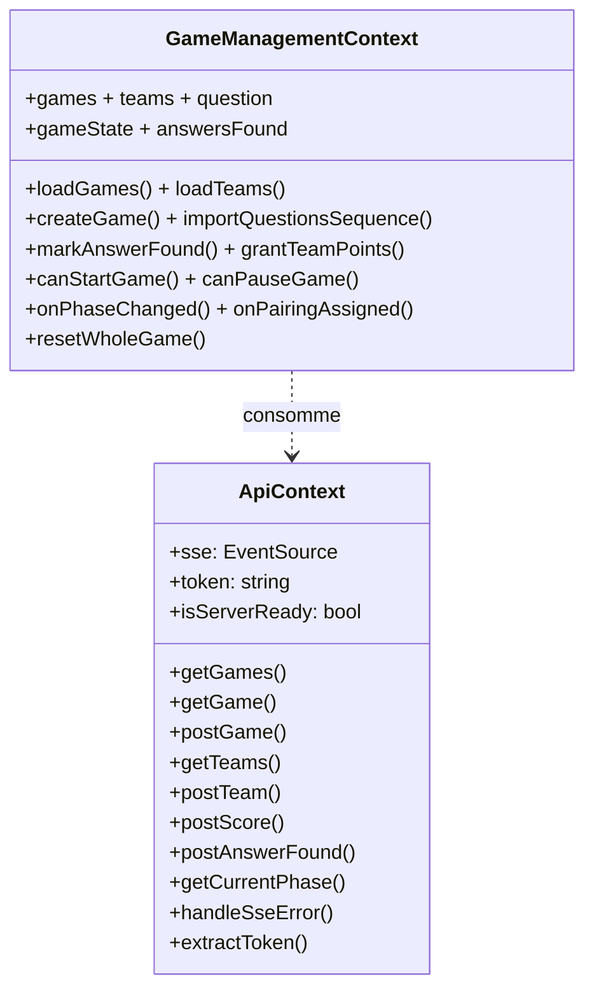

### 2.2 Découpage proposé — Contextes

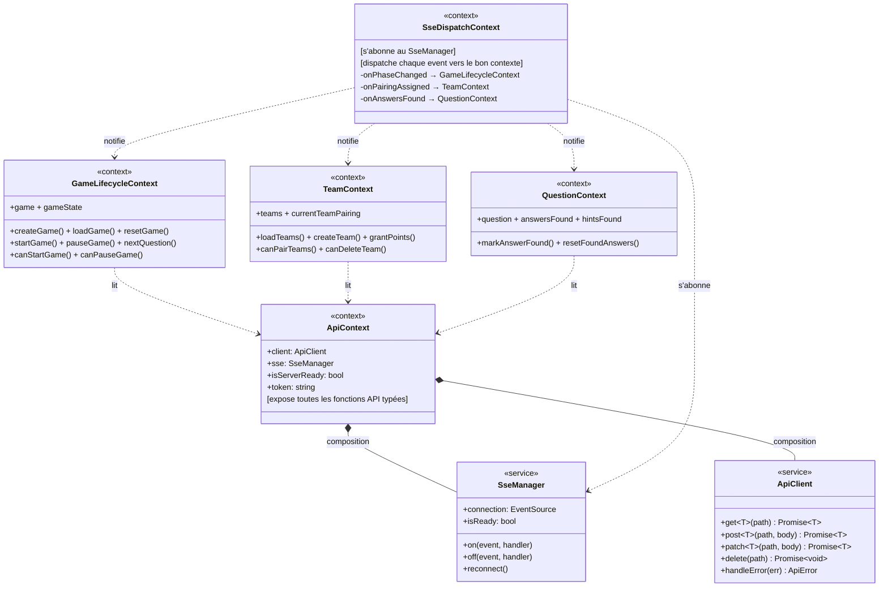

### 2.3 Structure de fichiers proposée

```
src/
├── services/
│   ├── ApiClient.ts          — fetch wrapper + gestion erreurs HTTP
│   └── SseManager.ts         — EventSource + reconnexion + on/off
│
├── Context/
│   ├── ApiContext.tsx         — compose ApiClient + SseManager, expose hooks API
│   ├── GameLifecycleContext.tsx — état jeu + transitions + guards canXxx
│   ├── TeamContext.tsx         — équipes + pairing + scores
│   ├── QuestionContext.tsx     — question active + réponses + indices
│   └── SseDispatchContext.tsx  — routing des events SSE vers les contextes métier
│
├── hooks/
│   ├── useGameController.ts   — extraite de GameController.tsx
│   ├── useGameCreationForm.ts — extraite de GameCreator.tsx
│   └── useSongController.ts   — extraite de SongController.tsx
│
├── utils/
│   ├── parseSseEvent.ts       — JSON.parse + try/catch (DRY, partagé)
│   ├── validateGameState.ts   — isValidGameState(), isValidPhase()
│   └── youtubeUtils.ts        — extractYoutubeId() (extrait de AdminHome)
│
└── Components/
    ├── GameController.tsx      — rendu pur, consomme useGameController
    ├── GameCreator.tsx         — rendu pur, consomme useGameCreationForm
    ├── SongController/
    │   ├── index.tsx           — dispatcher selon type de question
    │   ├── BlindTestController.tsx
    │   ├── MultipleChoiceController.tsx
    │   └── OpenQuestionController.tsx
    └── AdminHome.tsx           — orchestration, allégé
```

### 2.4 Diagramme de composition des contextes

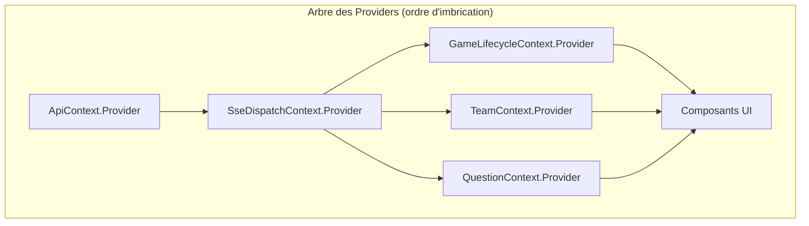

---

## 3. Game Front — `neon-beat-game-front`

### 3.1 État actuel

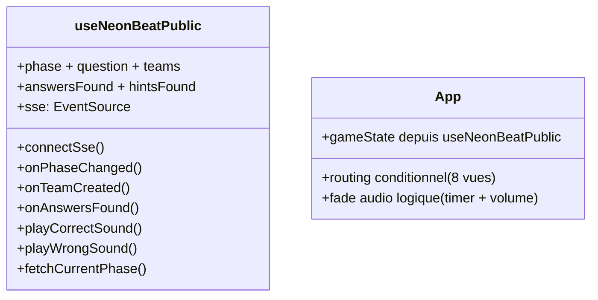

### 3.2 Découpage proposé

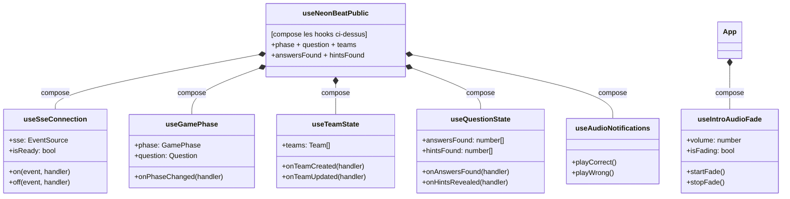

### 3.3 Structure de fichiers proposée

```
src/
├── hooks/
│   ├── useSseConnection.ts       — connexion SSE + reconnexion
│   ├── useGamePhase.ts           — état de phase + question
│   ├── useTeamState.ts           — liste des équipes
│   ├── useQuestionState.ts       — réponses + indices trouvés
│   ├── useAudioNotifications.ts  — sons correct/wrong
│   ├── useIntroAudioFade.ts      — fade intro (extrait de App)
│   └── useNeonBeatPublic.ts      — composition des hooks ci-dessus
│
├── utils/
│   ├── parseSseEvent.ts          — partagé avec admin-front (ou package commun)
│   └── quizzUtils.ts             — derivePropositions(), deriveOpenFoundAnswers()
│
└── components/
    ├── Quizz/
    │   ├── QuizzGame.tsx         — rendu pur, logique extraite dans quizzUtils
    │   └── ...
    └── App.tsx                   — routing pur, consomme useIntroAudioFade
```

---

## 4. Virtual Buzzer — `neon-beat-virtual-buzzer`

### 4.1 État actuel

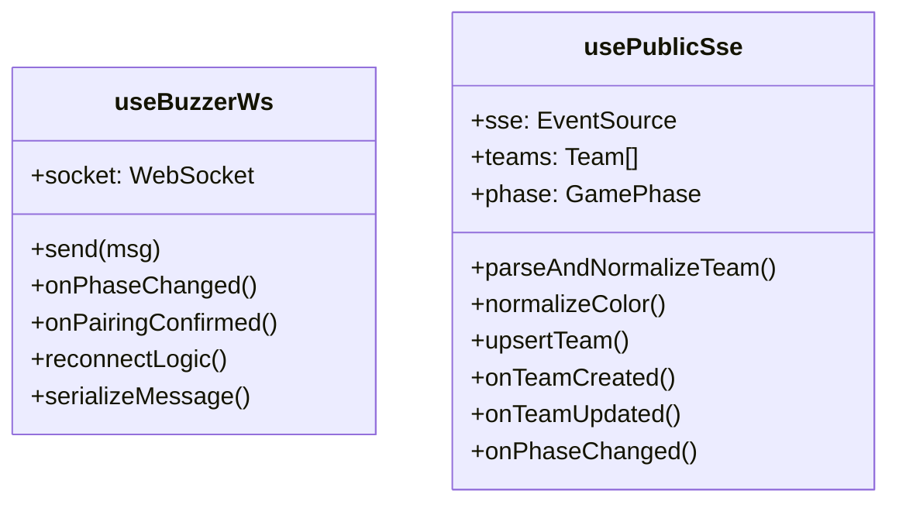

### 4.2 Découpage proposé

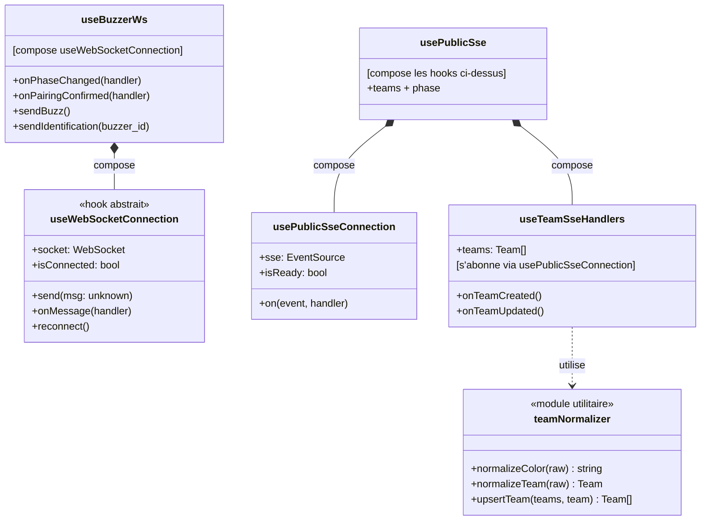

### 4.3 Structure de fichiers proposée

```
src/
├── hooks/
│   ├── useWebSocketConnection.ts — WS abstrait + reconnexion (réutilisable)
│   ├── useBuzzerWs.ts            — logique buzzer (compose useWebSocketConnection)
│   ├── usePublicSseConnection.ts — SSE abstrait (DRY avec game-front)
│   ├── useTeamSseHandlers.ts     — handlers équipes SSE
│   └── usePublicSse.ts           — composition
│
└── utils/
    └── teamNormalizer.ts         — fonctions pures de normalisation
```

---

## 5. Transversal — Code partagé (DRY)

Trois patterns sont réécrits dans chaque service sans abstraction commune :

### 5.1 Parsing SSE (dupliqué × 3 frontends)

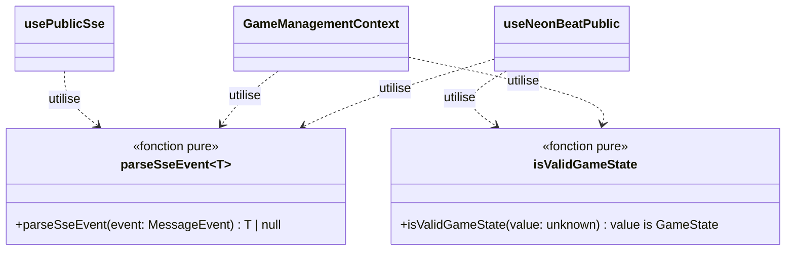

**Solution** : extraire dans un package partagé `@neon-beat/shared` ou a minima
un dossier `shared/` dans chaque repo avec les mêmes fichiers (acceptable si
les repos restent indépendants et que le partage via npm est jugé trop lourd).

### 5.2 Gestion des erreurs API (dupliqué × n appels)

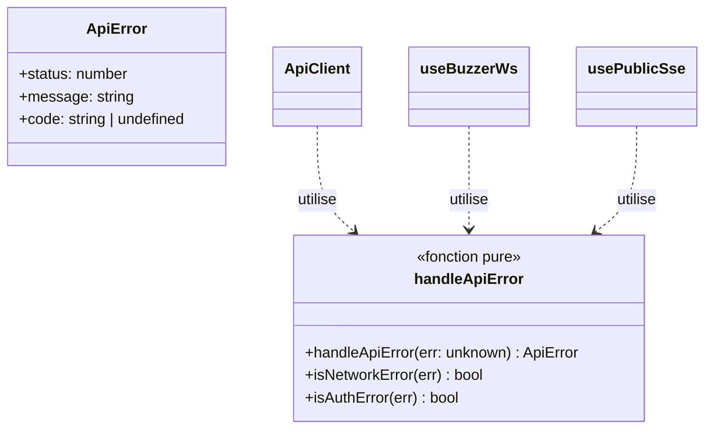

### 5.3 Reconnexion SSE (dupliqué × 3 frontends)

Les trois frontends réimplémentent la même logique de reconnexion SSE
(backoff, retry, cleanup). Cela peut être extrait en hook générique :

```typescript
// useEventSourceWithRetry.ts — partagé
function useEventSourceWithRetry(url: string, options?: {
  maxRetries?: number;
  backoffMs?: number;
}): { source: EventSource | null; isReady: boolean; reconnect: () => void }
```

---

## 6. Résumé des patterns appliqués

| Pattern | Où | Pourquoi |
|---|---|---|
| **Composition de hooks** | Tous les frontends | Un hook composite appelle des hooks spécialisés |
| **Trait + injection** | Rust backend | `GameEventPublisher` injecté dans les services (testabilité) |
| **Factory / Builder** | `QuestionSequenceBuilder` (Rust) | Construction complexe de modèles |
| **Dispatcher/Mediator** | `SseDispatchContext` (React) | Route les events SSE vers les bons contextes |
| **Adapter** | `ApiClient` | Isole fetch() du reste de l'app |
| **Pure utilities** | `parseSseEvent`, `teamNormalizer`, `quizzUtils` | Fonctions sans effet de bord, testables unitairement |

> **Règle d'or** : si un fichier a besoin d'un test, il doit être extractible
> sans dépendances cachées. Les fonctions pures et les services injectés
> sont toujours plus faciles à tester que les God objects.
