# Document d'architecture - Deploiement global de Neon Beat

## Sommaire

- [Document d'architecture - Deploiement global de Neon Beat](#document-darchitecture---deploiement-global-de-neon-beat)
  - [Sommaire](#sommaire)
  - [1. Introduction](#1-introduction)
    - [1.1 Contexte du projet](#11-contexte-du-projet)
    - [1.2 Objectifs](#12-objectifs)
  - [2. Analyse de la problematique](#2-analyse-de-la-problematique)
    - [2.1 Architecture actuelle](#21-architecture-actuelle)
    - [2.2 Limites du modele On Premise](#22-limites-du-modele-on-premise)
    - [2.3 Limites specifiques a Neon Beat](#23-limites-specifiques-a-neon-beat)
  - [3. Points critiques identifies](#3-points-critiques-identifies)
    - [3.1 Temps reel](#31-temps-reel)
    - [3.2 Latence mondiale](#32-latence-mondiale)
    - [3.3 Base de donnees](#33-base-de-donnees)
    - [3.4 Scalabilite](#34-scalabilite)
    - [3.5 Securite](#35-securite)
  - [4. Architecture cible proposee](#4-architecture-cible-proposee)
    - [4.1 Vue globale](#41-vue-globale)
    - [4.2 Choix d'infrastructure](#42-choix-dinfrastructure)
    - [4.3 Modele de deploiement recommande](#43-modele-de-deploiement-recommande)
      - [Version MVP / TP](#version-mvp--tp)
      - [Version production mondiale](#version-production-mondiale)
    - [4.4 Composants Kubernetes utilises](#44-composants-kubernetes-utilises)
  - [5. Schemas d'architecture](#5-schemas-darchitecture)
    - [5.1 Schema de composants](#51-schema-de-composants)
    - [5.2 Schema de flux utilisateur](#52-schema-de-flux-utilisateur)
    - [5.3 Schema de deploiement Kubernetes](#53-schema-de-deploiement-kubernetes)
    - [5.4 Schema de sequence temps reel](#54-schema-de-sequence-temps-reel)
  - [6. Scalabilite et resilience](#6-scalabilite-et-resilience)
    - [6.1 Scalabilite horizontale](#61-scalabilite-horizontale)
    - [6.2 Resilience](#62-resilience)
    - [6.3 Base de donnees](#63-base-de-donnees)
    - [6.4 Haute disponibilite multi-region](#64-haute-disponibilite-multi-region)
  - [7. Securite](#7-securite)
    - [7.1 Securite reseau](#71-securite-reseau)
    - [7.2 Gestion des secrets](#72-gestion-des-secrets)
    - [7.3 Securite applicative](#73-securite-applicative)
    - [7.4 RBAC Kubernetes](#74-rbac-kubernetes)
  - [8. Monitoring et observabilite](#8-monitoring-et-observabilite)
    - [8.1 Metriques](#81-metriques)
    - [8.2 Logs](#82-logs)
    - [8.3 Alerting](#83-alerting)
    - [8.4 Tracing](#84-tracing)
  - [9. Gestion du temps reel](#9-gestion-du-temps-reel)
    - [9.1 Problematique](#91-problematique)
    - [9.2 Solution proposee](#92-solution-proposee)
    - [9.3 Point de vigilance](#93-point-de-vigilance)
    - [9.4 Configuration Ingress recommandee](#94-configuration-ingress-recommandee)
  - [10. Fichiers de configuration fournis dans le ZIP](#10-fichiers-de-configuration-fournis-dans-le-zip)
    - [Structure du ZIP](#structure-du-zip)
    - [Detail des ressources Kubernetes par fichier](#detail-des-ressources-kubernetes-par-fichier)
    - [10.1 Variables de configuration Kubernetes](#101-variables-de-configuration-kubernetes)
  - [11. Justification des choix techniques](#11-justification-des-choix-techniques)
    - [11.1 Kubernetes](#111-kubernetes)
    - [11.2 CDN](#112-cdn)
    - [11.3 CouchDB](#113-couchdb)
    - [11.4 Redis Pub/Sub ou NATS](#114-redis-pubsub-ou-nats)
    - [11.5 Monitoring](#115-monitoring)
    - [11.6 Media audio/video et service VOD](#116-media-audiovideo-et-service-vod)
      - [Limites de YouTube](#limites-de-youtube)
      - [Architecture VOD recommandee](#architecture-vod-recommandee)
      - [Pourquoi un provider europeen](#pourquoi-un-provider-europeen)
      - [Comparatif des solutions VOD europeennes](#comparatif-des-solutions-vod-europeennes)
      - [Strategie multi-region : un provider VOD par zone geographique](#strategie-multi-region--un-provider-vod-par-zone-geographique)
      - [Option auto-hebergee : NAS loue en datacenter + transcoding Kubernetes](#option-auto-hebergee--nas-loue-en-datacenter--transcoding-kubernetes)
      - [Recommandation pour ce projet](#recommandation-pour-ce-projet)
      - [Integration dans Kubernetes](#integration-dans-kubernetes)
    - [11.7 Architecture evenementielle (EDA)](#117-architecture-evenementielle-eda)
      - [Contexte](#contexte)
      - [Principes de l'EDA appliques a Neon Beat](#principes-de-leda-appliques-a-neon-beat)
      - [Ce que cela resout pour Neon Beat](#ce-que-cela-resout-pour-neon-beat)
      - [Event Broker recommande : Redis Pub/Sub](#event-broker-recommande--redis-pubsub)
      - [Evolution vers CQRS](#evolution-vers-cqrs)
  - [12. Points de vigilance](#12-points-de-vigilance)
  - [13. Processus de correction du code](#13-processus-de-correction-du-code)
    - [13.1 Phase d'audit](#131-phase-daudit)
    - [13.2 Classification des problemes](#132-classification-des-problemes)
    - [13.3 Ordre de correction](#133-ordre-de-correction)
    - [13.4 Methode de correction par type](#134-methode-de-correction-par-type)
    - [13.5 Checklist de validation avant merge](#135-checklist-de-validation-avant-merge)
    - [13.6 Tests unitaires](#136-tests-unitaires)
  - [14. Plan de refactoring — Separation des responsabilites](#14-plan-de-refactoring--separation-des-responsabilites)
    - [14.1 Backend Rust — neon-beat-back](#141-backend-rust--neon-beat-back)
    - [14.2 Admin Front — neon-beat-admin-front](#142-admin-front--neon-beat-admin-front)
    - [14.3 Game Front — neon-beat-game-front](#143-game-front--neon-beat-game-front)
    - [14.4 Virtual Buzzer — neon-beat-virtual-buzzer](#144-virtual-buzzer--neon-beat-virtual-buzzer)
    - [14.5 Code transversal partage (DRY)](#145-code-transversal-partage-dry)
    - [14.6 Recapitulatif des patterns appliques](#146-recapitulatif-des-patterns-appliques)
  - [15. Integration continue (CI)](#15-integration-continue-ci)
    - [15.1 Strategie de branches et declenchement](#151-strategie-de-branches-et-declenchement)
    - [15.2 CI — Frontends React/Vite](#152-ci--frontends-reactvite)
    - [15.3 CI — Backend Rust/Axum](#153-ci--backend-rustaxum)
    - [15.4 CI — Manifestes Kubernetes](#154-ci--manifestes-kubernetes)
    - [15.5 Checklist CI avant merge](#155-checklist-ci-avant-merge)
  - [16. Processus de deploiement](#16-processus-de-deploiement)
    - [16.1 Prerequisites](#161-prerequisites)
    - [16.2 Construction et publication des images](#162-construction-et-publication-des-images)
    - [16.3 Deploiement pre-production](#163-deploiement-pre-production)
    - [16.4 Deploiement production](#164-deploiement-production)
    - [16.5 Validation post-deploiement production](#165-validation-post-deploiement-production)
    - [16.6 Procedure de rollback](#166-procedure-de-rollback)
    - [16.7 Mise a jour d'une image uniquement](#167-mise-a-jour-dune-image-uniquement)
    - [16.8 Rotation des secrets](#168-rotation-des-secrets)
  - [17. Conclusion](#17-conclusion)

---

## 1. Introduction

### 1.1 Contexte du projet

Neon Beat est une application de blind test et de quiz musical temps reel. Elle permet a un administrateur de piloter une partie, a un ecran public d'afficher l'etat du jeu, et a des joueurs d'interagir via des buzzers physiques ou virtuels.

L'application est aujourd'hui composee de plusieurs microservices ou depots applicatifs :

| Composant                    | Role                                                                      | Technologie principale    |
| ---------------------------- | ------------------------------------------------------------------------- | ------------------------- |
| `neon-beat-back`           | Backend central, API REST, WebSocket, SSE, logique de partie, persistance | Rust / Axum               |
| `neon-beat-admin-front`    | Interface d'administration pour le game master                            | React / Vite / Ant Design |
| `neon-beat-game-front`     | Interface publique affichant questions, blindtest, quiz et scores         | React / Vite              |
| `neon-beat-virtual-buzzer` | Buzzer web virtuel pour les joueurs                                       | React / Vite              |
| `neon-beat-docs`           | Documentation et diagrammes d'architecture                                | Markdown / PlantUML       |
| CouchDB ou MongoDB           | Stockage des parties, equipes, sequences de questions                     | Base documentaire         |

L'objectif de ce document est de proposer une architecture cible permettant de deployer Neon Beat a l'echelle mondiale, avec de bonnes performances, une meilleure disponibilite et une exploitation plus fiable.

### 1.2 Objectifs

Les objectifs principaux sont :

- deployer l'application a l'echelle mondiale ;
- reduire la latence percue par les joueurs ;
- garantir une haute disponibilite des composants critiques ;
- securiser les echanges entre clients, backend et base de donnees ;
- permettre la scalabilite automatique ;
- superviser l'etat de la plateforme ;
- faciliter les deploiements et les mises a jour ;
- preparer une architecture compatible avec Kubernetes.

---

## 2. Analyse de la problematique

### 2.1 Architecture actuelle

L'architecture actuelle repose sur :

- un backend Rust expose sur HTTP ;
- des endpoints REST publics et admin ;
- des flux Server-Sent Events :
  - `/sse/public` pour les frontends publics et buzzers virtuels ;
  - `/sse/admin` pour l'interface administrateur ;
- un WebSocket `/ws` pour les buzzers ;
- une base CouchDB ou MongoDB ;
- trois frontends Vite :
  - `/admin` pour l'administration ;
  - `/buzzer` pour les buzzers virtuels ;
  - le game front pour l'affichage public.

Schema simplifie :

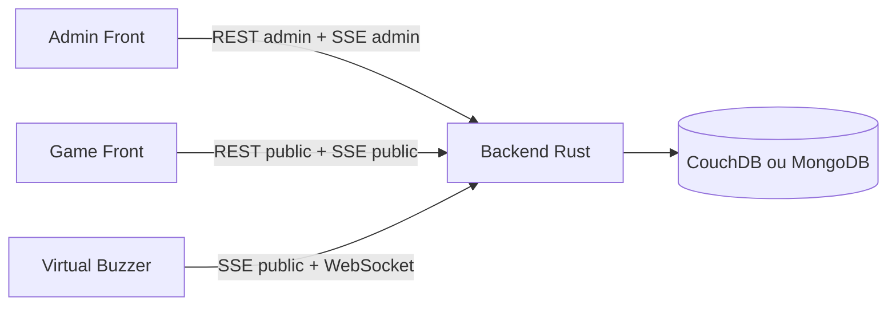

### 2.2 Limites du modele On Premise

Un deploiement On Premise ou mono-machine presente plusieurs limites :

- scalabilite limitee ;
- faible tolerance aux pannes ;
- maintenance et mises a jour plus difficiles ;
- exposition internet et TLS a gerer manuellement ;
- monitoring souvent incomplet ;
- sauvegardes moins automatisees ;
- latence elevee pour les joueurs geographiquement eloignes ;
- risque de coupure totale si le serveur unique tombe.

### 2.3 Limites specifiques a Neon Beat

Neon Beat utilise beaucoup de temps reel. Cela cree des contraintes particulieres :

- les connexions SSE sont longues ;
- les connexions WebSocket doivent rester stables ;
- le backend conserve de l'etat de partie en memoire ;
- le flux admin SSE est limite a une seule connexion ;
- plusieurs replicas backend peuvent diverger si aucun bus d'evenements ou stockage partage n'est utilise pour synchroniser l'etat temps reel.

---

## 3. Points critiques identifies

### 3.1 Temps reel

Le temps reel est critique pour Neon Beat car il synchronise :

- l'etat de la partie ;
- la question courante ;
- les buzzers ;
- les phases de jeu ;
- les scores ;
- les validations de reponse ;
- l'affichage public ;
- l'interface administrateur.

Un delai trop important ou un evenement perdu peut provoquer une mauvaise experience : buzz non pris en compte, score incoherent, affichage public en retard, ou admin desynchronise.

### 3.2 Latence mondiale

Si tous les joueurs se connectent a une seule region, les joueurs eloignes peuvent subir une latence importante.

Exemple :

- un backend heberge en Europe ;
- des joueurs en Amerique du Sud ou en Asie ;
- les buzzers doivent traverser une grande distance reseau ;
- un joueur proche du serveur peut etre avantage par rapport a un joueur eloigne.

Pour un jeu base sur le buzz, cette latence est un point fonctionnel important, pas seulement un probleme de confort.

### 3.3 Base de donnees

La base de donnees stocke les parties, equipes, scores et sequences de questions. Les enjeux sont :

- disponibilite ;
- persistance des donnees ;
- sauvegardes ;
- restauration ;
- replication ;
- coherence ;
- performance en ecriture lors des changements de score ou d'etat.

CouchDB est interessant pour Neon Beat car il supporte un modele documentaire et de la replication. MongoDB est aussi supporte par le backend, mais le template cible principalement CouchDB.

### 3.4 Scalabilite

Les composants a scaler ne se comportent pas tous de la meme maniere.

| Composant       | Scalabilite            | Remarque                                                |
| --------------- | ---------------------- | ------------------------------------------------------- |
| Frontend admin  | Tres simple            | Fichiers statiques, CDN possible                        |
| Frontend game   | Tres simple            | Fichiers statiques, CDN possible                        |
| Frontend buzzer | Tres simple            | Fichiers statiques, CDN possible                        |
| Backend Rust    | Possible mais sensible | Necessite synchronisation temps reel entre pods         |
| WebSocket / SSE | Sensible               | Connexions longues, sticky sessions ou bus d'evenements |
| CouchDB         | Possible               | StatefulSet, volumes, replication                       |

### 3.5 Securite

Les points de securite essentiels sont :

- HTTPS obligatoire ;
- authentification admin ;
- protection du token admin ;
- validation stricte des entrees ;
- limitation des abus sur `/ws` et `/sse/*` ;
- gestion des secrets hors du code source ;
- RBAC Kubernetes ;
- Network Policies ;
- restrictions d'acces a CouchDB ;
- sauvegardes chiffrees si possible.

---

## 4. Architecture cible proposee

### 4.1 Vue globale

Architecture cible recommandee :

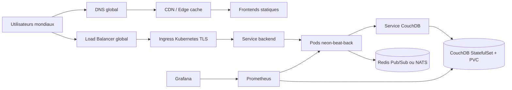

Les frontends peuvent etre servis par CDN, tandis que le backend reste expose via un Ingress Kubernetes compatible HTTP, SSE et WebSocket.

### 4.2 Choix d'infrastructure

Proposition :

- Kubernetes manage ;
- cluster multi-zone pour la haute disponibilite ;
- CDN pour les assets frontend ;
- Ingress Controller avec TLS ;
- Load Balancer global ou DNS geographique ;
- CouchDB en StatefulSet avec volumes persistants ;
- event bus Redis Pub/Sub ou NATS si plusieurs replicas backend sont utilises ;
- monitoring centralise avec Prometheus, Grafana et Loki ;
- backups automatises via CronJob.

### 4.3 Modele de deploiement recommande

#### Version MVP / TP

Pour un TP Kubernetes, une architecture raisonnable est :

- 1 cluster Kubernetes ;
- 1 namespace `neon-beat` ;
- 1 backend Rust avec 1 replica au depart ;
- 1 CouchDB en StatefulSet ;
- 3 frontends servis via Nginx ou un bucket/CDN ;
- 1 Ingress avec routes :
  - `/admin` vers admin front ;
  - `/buzzer` vers buzzer front ;
  - `/` vers game front ;
  - `/api`, `/public`, `/admin-api`, `/sse`, `/ws` ou directement `/public`, `/admin`, `/sse`, `/ws` vers le backend selon le routage retenu.

Cette version est simple et coherente avec l'etat actuel du backend.

#### Version production mondiale

Pour une version mondiale :

- frontends sur CDN global ;
- backend deploye en multi-zone ;
- event bus pour synchroniser les evenements temps reel ;
- base CouchDB repliquee ;
- observabilite complete ;
- strategie de routage par region de partie.

Pour une meme partie mondiale, il faut definir une region autoritative. Tous les buzzers d'une meme partie doivent etre arbitres par le meme domaine logique pour eviter les conflits.

### 4.4 Composants Kubernetes utilises

Les objets Kubernetes recommandes sont :

- `Namespace` pour isoler Neon Beat ;
- `Deployment` pour le backend ;
- `Deployment` ou hebergement statique pour les frontends ;
- `Service` pour exposer les pods en interne ;
- `Ingress` pour le routage HTTP public ;
- `ConfigMap` pour la configuration non sensible ;
- `Secret` pour les credentials CouchDB et tokens ;
- `HorizontalPodAutoscaler` pour scaler les frontends (le backend reste a 1 replica tant que l'etat temps reel n'est pas externalise via un event broker) ;
- `StatefulSet` pour CouchDB ;
- `PersistentVolumeClaim` pour les donnees CouchDB ;
- `NetworkPolicy` pour limiter les communications internes ;
- `CronJob` pour les backups ;
- `PodDisruptionBudget` pour la disponibilite ;
- `ServiceMonitor` si Prometheus Operator est utilise.

---

## 5. Schemas d'architecture

### 5.1 Schema de composants

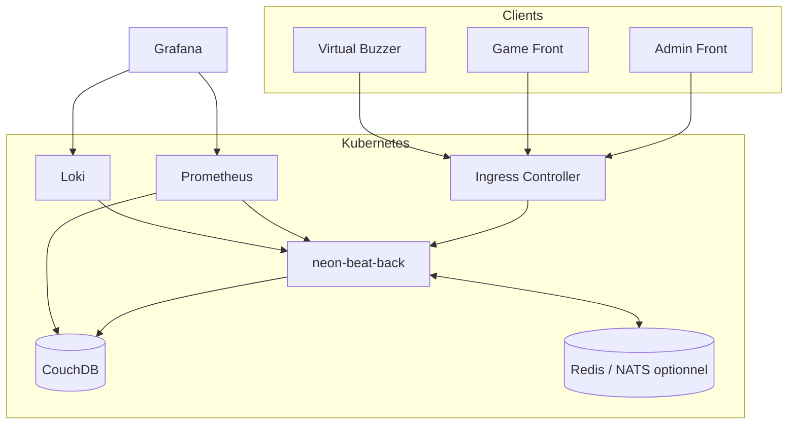

### 5.2 Schema de flux utilisateur

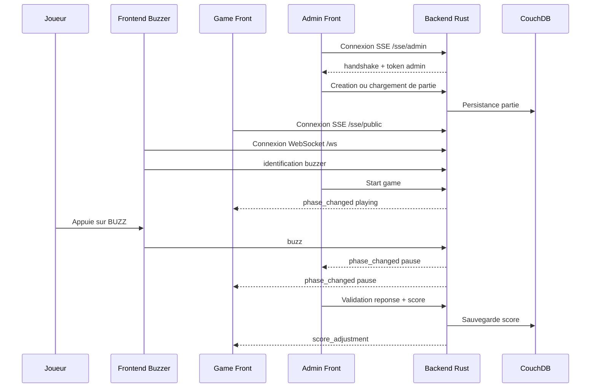

### 5.3 Schema de deploiement Kubernetes

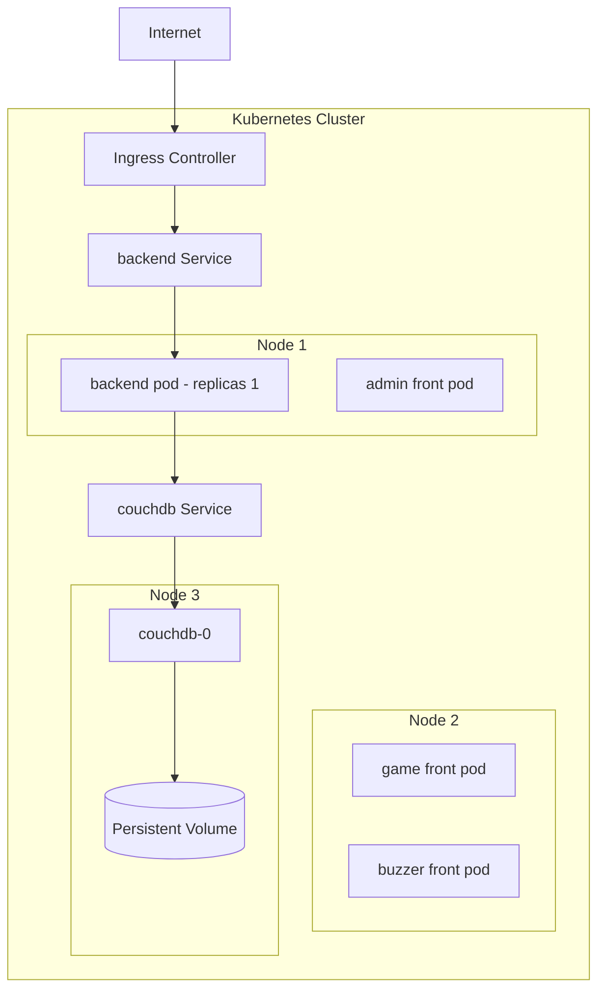

> Note : le backend est deploye a **1 replica** dans ce schema (MVP / TP). Les frontends
> sont repartis sur plusieurs nodes et peuvent etre scales via HPA. Un second replica
> backend n'est envisageable qu'apres integration d'un event broker — voir section 11.7.

### 5.4 Schema de sequence temps reel

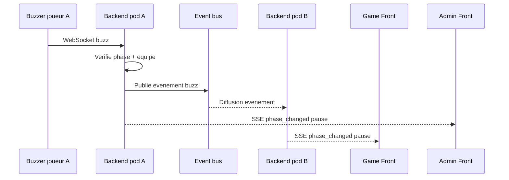

Ce schema illustre l'architecture cible avec event broker. Il devient actif des que Redis
Pub/Sub ou NATS est integre — voir section 11.7 pour le detail de cette evolution.

---

## 6. Scalabilite et resilience

### 6.1 Scalabilite horizontale

Les frontends peuvent etre scales facilement car ils sont statiques. Le meilleur choix est de les servir via CDN ou via plusieurs replicas Nginx.

Le backend Rust peut etre scale horizontalement avec un `HorizontalPodAutoscaler`, mais seulement si l'etat temps reel est partage correctement.

Strategies possibles :

| Strategie                                     | Avantage                           | Limite                                       |
| --------------------------------------------- | ---------------------------------- | -------------------------------------------- |
| 1 replica backend par partie ou environnement | Simple, coherent                   | Moins scalable                               |
| Sticky sessions                               | Evite certaines desynchronisations | Ne resout pas tous les evenements inter-pods |
| Redis Pub/Sub ou NATS                         | Synchronise les evenements         | Ajoute un composant                          |
| Etat de partie externalise                    | Plus robuste                       | Refactor backend plus important              |

Pour Neon Beat, il est recommande de commencer avec un seul replica backend pour une partie active, puis d'ajouter Redis/NATS avant d'augmenter le nombre de replicas.

### 6.2 Resilience

Mecanismes recommandes :

- plusieurs replicas pour les frontends ;
- readiness probes pour eviter d'envoyer du trafic vers un pod non pret ;
- liveness probes pour redemarrer un pod bloque ;
- rolling updates ;
- `PodDisruptionBudget` ;
- deploiement multi-zone ;
- ressources CPU/RAM definies ;
- backups reguliers ;
- restauration testee.

### 6.3 Base de donnees

Pour CouchDB :

- utiliser un `StatefulSet` ;
- attacher un `PersistentVolumeClaim` ;
- definir des credentials via `Secret` ;
- exposer CouchDB uniquement en interne ;
- mettre en place des sauvegardes ;
- envisager la replication CouchDB entre regions si l'objectif mondial est strict.

Pour MongoDB :

- utiliser un replica set manage ou un operator Kubernetes ;
- eviter une instance unique sans sauvegarde ;
- separer les credentials dans des `Secrets`.

### 6.4 Haute disponibilite multi-region

Le multi-region actif-actif est complexe pour un jeu de buzz. Une partie doit avoir une autorite unique pour arbitrer le premier buzz.

Approche recommandee :

- router les utilisateurs vers la region de leur partie ;
- creer une partie dans une region donnee ;
- garder le backend autoritatif dans cette region ;
- repliquer les donnees non critiques vers d'autres regions ;
- utiliser un CDN pour reduire la latence des frontends.

---

## 7. Securite

### 7.1 Securite reseau

Mesures recommandees :

- HTTPS obligatoire via Ingress TLS ;
- redirection HTTP vers HTTPS ;
- Network Policies ;
- CouchDB accessible uniquement depuis le backend ;
- Redis/NATS accessible uniquement depuis le backend ;
- restriction des ports exposes ;
- limitation des origines CORS en production.

### 7.2 Gestion des secrets

Les secrets ne doivent pas etre stockes dans le code source.

Secrets concernes :

- mot de passe CouchDB ;
- credentials MongoDB ;
- eventuels tokens admin statiques si ajoutes plus tard ;
- credentials de stockage objet pour backups ;
- credentials de monitoring externe.

Solutions possibles :

- `Secret` Kubernetes pour le TP ;
- Sealed Secrets ;
- External Secrets Operator ;
- coffre de secrets cloud : AWS Secrets Manager, Azure Key Vault, Google Secret Manager, Vault.

### 7.3 Securite applicative

Le backend actuel utilise un token admin fourni par le flux `/sse/admin`. Pour une production mondiale, il faudrait renforcer ce modele.

Ameliorations recommandees :

- authentification admin explicite ;
- expiration du token admin ;
- authentification par compte ou SSO ;
- rate limiting sur `/ws`, `/sse/*` et `/admin/**` ;
- validation stricte des payloads ;
- logs d'audit sur les actions admin ;
- protection contre les buzzers frauduleux ;
- limitation du nombre de connexions par IP.

### 7.4 RBAC Kubernetes

Recommandations :

- creer un `ServiceAccount` dedie ;
- limiter les droits au namespace `neon-beat` ;
- eviter les permissions cluster-admin ;
- separer les droits de deploiement CI/CD et les droits runtime.

---

## 8. Monitoring et observabilite

### 8.1 Metriques

Prometheus peut collecter :

- CPU ;
- RAM ;
- reseau ;
- nombre de pods disponibles ;
- latence API ;
- erreurs HTTP 4xx/5xx ;
- nombre de connexions SSE ;
- nombre de connexions WebSocket ;
- temps de reponse CouchDB ;
- taux d'erreur base de donnees ;
- redemarrages de pods ;
- saturation des volumes.

Metriques applicatives a ajouter au backend :

- nombre de parties actives ;
- nombre d'equipes ;
- nombre de buzzers connectes ;
- nombre d'evenements SSE emis ;
- latence entre buzz et pause de partie ;
- erreurs de validation admin ;
- erreurs de persistance.

### 8.2 Logs

Les logs a centraliser :

- logs backend Rust ;
- logs Ingress ;
- logs CouchDB ;
- logs Redis/NATS si utilise ;
- logs des jobs de backup ;
- logs d'erreurs frontend si un collecteur client est ajoute.

Solutions possibles :

- Loki + Grafana ;
- ELK / OpenSearch ;
- solution cloud managee.

### 8.3 Alerting

Alertes recommandees :

- backend indisponible ;
- CouchDB indisponible ;
- erreurs 5xx elevees ;
- latence API elevee ;
- taux de reconnexion WebSocket anormal ;
- connexions SSE qui chutent ;
- PVC presque plein ;
- backup en echec ;
- replication CouchDB en erreur ;
- nombre de redemarrages de pods eleve.

### 8.4 Tracing

Pour une version avancee, OpenTelemetry peut etre ajoute afin de suivre :

- appels admin ;
- transitions de phase ;
- persistance en base ;
- emission SSE ;
- traitement d'un buzz.

---

## 9. Gestion du temps reel

### 9.1 Problematique

Le temps reel est essentiel pour synchroniser les joueurs, les buzzers et l'etat de la partie.

Dans Neon Beat, les canaux temps reel sont :

- WebSocket `/ws` pour les buzzers ;
- SSE `/sse/public` pour le public ;
- SSE `/sse/admin` pour l'administration.

Ces connexions sont longues. Elles doivent rester compatibles avec :

- Ingress Controller ;
- Load Balancer ;
- timeouts ;
- rolling updates ;
- scalabilite horizontale.

### 9.2 Solution proposee

Pour un premier deploiement :

- garder un seul replica backend pour eviter les incoherences ;
- activer les probes ;
- configurer correctement les timeouts Ingress ;
- exposer `/ws` avec support WebSocket ;
- exposer `/sse/*` sans buffering.

Pour un deploiement scalable :

- ajouter Redis Pub/Sub ou NATS ;
- publier chaque evenement de partie dans le bus ;
- chaque pod backend relaie les evenements aux clients connectes localement ;
- utiliser sticky sessions si necessaire pour stabiliser les connexions ;
- externaliser ou synchroniser l'etat de partie.

### 9.3 Point de vigilance

Si plusieurs pods backend existent, un joueur connecte au pod A doit pouvoir recevoir un evenement emis depuis le pod B.

Sans bus d'evenements :

- un admin peut modifier l'etat sur un pod ;
- un joueur connecte a un autre pod ne recoit pas l'evenement ;
- le jeu devient incoherent.

Un bus d'evenements est donc recommande avant de scaler le backend au-dela d'un replica pour une meme partie.

### 9.4 Configuration Ingress recommandee

Selon l'Ingress Controller, il faut prevoir :

- timeout long pour SSE ;
- timeout long pour WebSocket ;
- desactivation du buffering pour SSE ;
- support upgrade WebSocket ;
- taille de body suffisante pour importer des sequences de questions.

Exemple conceptuel pour Nginx Ingress :

```yaml
nginx.ingress.kubernetes.io/proxy-read-timeout: "3600"
nginx.ingress.kubernetes.io/proxy-send-timeout: "3600"
nginx.ingress.kubernetes.io/proxy-buffering: "off"
```

---

## 10. Fichiers de configuration fournis dans le ZIP

La livraison est organisee par dossier. Chaque environnement (prod, preprod) est
isole dans son propre repertoire. Les composants cluster (cert-manager, namespace)
sont dans des dossiers dedies.

### Structure du ZIP

```
k8s/
├── namespace.yml                        — Namespace production (neon-beat)
├── setup.sh                             — Script d'initialisation cluster
│
├── cert-manager/
│   ├── cluster-issuer-cloudflare.yml    — ClusterIssuer Let's Encrypt (DNS01 Cloudflare)
│   ├── cloudflare-secret.yml            — Secret token API Cloudflare
│   └── cloudflare-secret.yml.example    — Exemple a adapter
│
├── app/
│   └── ingress.yml                      — Template Ingress generique (deux domaines)
│
├── prod/                                — Manifestes production
│   ├── configmap.yml                    — Variables non sensibles
│   ├── secret.example.yml               — Exemple de secrets a adapter
│   ├── deployment.yml                   — CouchDB (StatefulSet) + back + 3 frontends
│   ├── service.yml                      — Services ClusterIP pour tous les pods
│   ├── ingress.yml                      — Ingress TLS (API + frontends)
│   ├── hpa.yml                          — HPA frontends (2-10 replicas, CPU 70 %)
│   ├── network-policy.yml               — Politique default-deny + regles minimales
│   ├── pdb.yml                          — PodDisruptionBudget (minAvailable: 1)
│   └── backup-cronjob.yml               — CronJob backup CouchDB quotidien (02h UTC)
│
└── preprod/                             — Manifestes pre-production (parite prod)
    ├── namespace.yml                    — Namespace preprod (neon-beat-preprod)
    ├── configmap.yml
    ├── secret.example.yml
    ├── deployment.yml
    ├── service.yml
    └── ingress.yml
```

### Detail des ressources Kubernetes par fichier

| Fichier                                        | Ressources creees                                                          |
| ---------------------------------------------- | -------------------------------------------------------------------------- |
| `namespace.yml`                              | `Namespace` neon-beat                                                    |
| `preprod/namespace.yml`                      | `Namespace` neon-beat-preprod                                            |
| `prod/configmap.yml`                         | `ConfigMap` neon-beat-prod-config                                        |
| `prod/secret.example.yml`                    | `Secret` neon-beat-prod-secrets (exemple)                                |
| `prod/deployment.yml`                        | `StatefulSet` CouchDB + `Deployment` back + 3 `Deployment` frontends |
| `prod/service.yml`                           | 5 `Service` ClusterIP (couchdb, back, game-front, admin-front, buzzer)   |
| `prod/ingress.yml`                           | 2 `Ingress` TLS (api.neon-beat.example.com + neon-beat.example.com)      |
| `prod/hpa.yml`                               | 3 `HorizontalPodAutoscaler` (game-front, admin-front, buzzer-front)      |
| `prod/network-policy.yml`                    | 4 `NetworkPolicy` (default-deny + 3 regles autorisation)                 |
| `prod/pdb.yml`                               | 3 `PodDisruptionBudget` (game-front, admin-front, buzzer-front)          |
| `prod/backup-cronjob.yml`                    | `PersistentVolumeClaim` + `CronJob` backup CouchDB                       |
| `cert-manager/cluster-issuer-cloudflare.yml` | 2 `ClusterIssuer` (staging + prod)                                       |

### 10.1 Variables de configuration Kubernetes

Backend :

```env
PORT=8080
NEON_STORE=couch
COUCH_BASE_URL=http://neon-beat-prod-couchdb:5984
COUCH_DB=neon_beat
RUST_LOG=info
```

Frontends :

```env
VITE_API_BASE_URL=https://api.neon-beat.example.com
```

Important : les variables `VITE_*` sont injectees au build. Si les images frontend sont deja construites, il faut soit reconstruire par environnement, soit utiliser une configuration runtime via fichier JS genere au demarrage.

---

## 11. Justification des choix techniques

### 11.1 Kubernetes

Kubernetes est adapte car il apporte :

- deploiements reproductibles ;
- rolling updates ;
- scalabilite horizontale ;
- auto-healing ;
- isolation par namespace ;
- gestion des ressources ;
- integration avec monitoring, secrets et ingress ;
- portabilite entre cloud providers.

### 11.2 CDN

Le CDN est recommande pour les frontends car :

- les assets React sont statiques ;
- la latence mondiale diminue ;
- le cluster est moins sollicite ;
- les fichiers JS/CSS/images sont caches proche des utilisateurs ;
- la disponibilite des interfaces augmente.

### 11.3 CouchDB

CouchDB est justifie car :

- il est deja supporte par le backend ;
- le modele documentaire correspond aux parties et sequences de questions ;
- il peut etre replique ;
- il fonctionne bien avec des documents JSON.

Limite : CouchDB reste un composant stateful. Son exploitation Kubernetes doit etre plus prudente qu'un simple Deployment.

### 11.4 Redis Pub/Sub ou NATS

Un bus d'evenements est recommande si le backend est scale :

- synchronisation des evenements entre pods ;
- diffusion des `phase_changed`, `score_adjustment`, `team.updated`, etc. ;
- reduction du couplage entre connexions SSE et pod ayant traite l'action.

Redis Pub/Sub est simple pour un TP. NATS est plus robuste pour une architecture evenementielle avancee.

### 11.5 Monitoring

Le monitoring est indispensable pour :

- detecter rapidement les incidents ;
- comprendre les lenteurs ;
- surveiller les connexions temps reel ;
- anticiper la saturation ;
- valider les deploiements ;
- documenter le comportement de la plateforme.

### 11.6 Media audio/video et service VOD

#### Limites de YouTube

Le backend utilise actuellement des URLs YouTube pour les questions de type `blind_test`.
Ce choix est fonctionnel pour un TP, mais presente des risques importants en production mondiale :

- une video peut etre supprimee ou rendue privee par son proprietaire a tout moment ;
- certaines videos sont bloquees geographiquement — un joueur en Asie peut ne pas voir
  la meme video qu'un joueur en Europe ;
- les restrictions d'age et les politiques de cookies varient selon les pays ;
- les publicites YouTube interrompent le blind test et perturbent le minutage (`starts_at_ms`) ;
- l'API YouTube impose des quotas journaliers — une forte affluence peut les epuiser ;
- la dependance a un service tiers non maitrise cree un point de defaillance externe.

Pour un contexte competitif ou pedagogique, la disponibilite garantie des extraits est
une contrainte fonctionnelle, pas un simple confort.

#### Architecture VOD recommandee

La solution recommandee est d'integrer un service VOD (Video On Demand) dedie. L'administrateur
uploade les extraits une fois ; le service VOD les encode, les heberge et les distribue via CDN.

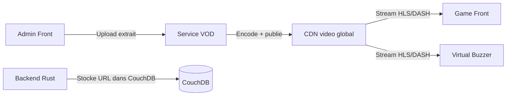

Flux de gestion :

1. L'administrateur uploade un extrait (MP3, MP4) via l'interface admin ou directement
   dans le service VOD.
2. Le service encode le media (plusieurs qualites, format HLS ou DASH).
3. L'URL du stream est stockee dans CouchDB comme valeur du champ `url` de la question.
4. Au moment du blind test, le frontend recoit l'URL, initialise le lecteur et demarre
   la lecture a `starts_at_ms`.

#### Pourquoi un provider europeen

Au-dela des limites de YouTube, le choix du provider VOD a des implications legales
directes pour un deploiement mondial :

- les services americains sont soumis au **Cloud Act** : les autorites americaines
  peuvent exiger l'acces aux donnees hebergees, meme sur des serveurs situes en Europe ;
- le **RGPD** impose de connaitre precisement ou les donnees sont stockees et traitees ;
- les extraits audio/video peuvent etre soumis au droit d'auteur — heberger ce contenu
  chez un provider europeen simplifie la conformite legale et les relations avec les
  ayants droit.

Un service VOD manage europeen repond a toutes ces contraintes par defaut, sans
configuration additionnelle.

#### Comparatif des solutions VOD europeennes

| Solution                                       | Pays                | Type         | Avantages                                                                                                                                                                     | Inconvenients                                                                                         |
| ---------------------------------------------- | ------------------- | ------------ | ----------------------------------------------------------------------------------------------------------------------------------------------------------------------------- | ----------------------------------------------------------------------------------------------------- |
| **Infomaniak VOD/AOD**                   | Suisse              | Manage       | RGPD natif, loi suisse sur la protection des donnees (plus stricte que l'UE), encodage automatique, lecteur integre, API REST, meme provider possible pour DNS et hebergement | CDN moins etendu hors Europe qu'un provider mondial                                                   |
| **Bunny Stream**                         | Slovenie (UE)       | Manage       | Societe europeenne, CDN mondial depuis datacenters UE, prix tres competitifs a l'usage, API simple, encodage HLS automatique                                                  | Moins de fonctionnalites avancees qu'un encodeur dedie                                                |
| **Gcore Video Streaming**                | Luxembourg (UE)     | Manage       | Infrastructure edge europeenne, faible latence, encodage automatique, bon CDN mondial, SLA fort                                                                               | Moins connu, ecosysteme plus restreint qu'Infomaniak ou Bunny                                         |
| **NAS loue (Synology) + Job FFmpeg k8s** | UE (selon provider) | Auto-heberge | Souverainete totale, cout par Go tres bas, RAID natif Synology, CPU du NAS preserve — FFmpeg tourne sur k8s, stockage independant du cluster                                 | NAS = point de defaillance supplementaire, latence reseau cluster-NAS a maitriser, pas de CDN integre |

#### Strategie multi-region : un provider VOD par zone geographique

Pour un deploiement mondial de Neon Beat, utiliser un seul provider VOD centralise
introduit de la latence pour les joueurs eloignes et des contraintes juridiques
(donnees europeennes soumises au Cloud Act si le provider est americain, contenu
soumis au droit local de chaque territoire).

La solution est de **selectionner un provider VOD par region**, chacun hebergeant
le contenu dans sa zone, avec un routage cote backend selon l'origine de la requete.

##### Providers recommandes par region

| Region | Provider | Pays | Type | Specificitie |
| ------ | -------- | ---- | ---- | ------------ |
| **Europe** | Infomaniak VOD/AOD | Suisse | Manage | RGPD natif, loi suisse, recommande principal |
| **Europe (alt.)** | Bunny Stream | Slovenie (UE) | Manage | Prix competitifs, CDN UE |
| **Europe (alt.)** | Gcore Video Streaming | Luxembourg (UE) | Manage | Edge reseau UE, SLA fort |
| **Ameriques** | Cloudflare Stream | USA (edge mondial) | Manage | API simple, encodage automatique, tres competitive |
| **Ameriques (alt.)** | Mux | USA | Manage | Developer-first, excellente API, analytics avances |
| **Asie / Pacifique** | Alibaba Cloud ApsaraVideo VOD | Chine | Manage | Dominant en Chine et SE Asie, encodage HLS/DASH |
| **Asie / Pacifique (alt.)** | Tencent Cloud VOD | Chine | Manage | Ecosysteme WeChat, fort en Chine continentale |

> **Attention Chine** : diffuser du contenu vers la Chine continentale requiert une
> licence **ICP (备案)** delivree par le gouvernement chinois. Sans cette licence,
> le service est inaccessible aux utilisateurs en Chine. C'est une contrainte legale,
> pas technique.

##### Architecture geo-routee

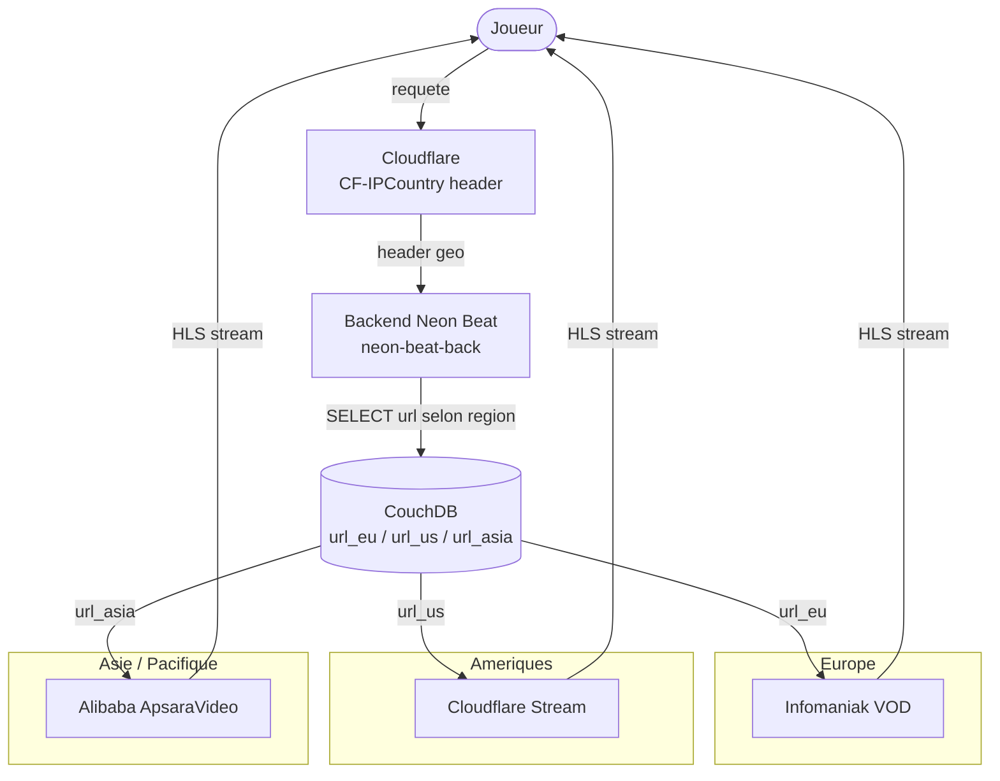

##### Modele de donnees CouchDB

Chaque document media stocke une URL par region. Le backend retourne l'URL
correspondant a la zone detectee :

```json
{
  "_id": "track_001",
  "type": "track",
  "title": "Around the World",
  "starts_at_ms": 15000,
  "guess_duration_ms": 30000,
  "url_eu":   "https://vod.infomaniak.com/.../track_001/master.m3u8",
  "url_us":   "https://stream.cloudflare.com/.../track_001/manifest.m3u8",
  "url_asia": "https://vod.aliyuncs.com/.../track_001/index.m3u8"
}
```

Le backend lit le header `CF-IPCountry` (injecte automatiquement par Cloudflare)
et retourne `url_eu`, `url_us` ou `url_asia` selon la valeur :

```
EU/CH/GB/...  →  url_eu
US/CA/MX/...  →  url_us
CN/JP/KR/...  →  url_asia
```

Si Cloudflare n'est pas en frontal, la geolocalisation peut etre derivee de l'IP
via une base GeoIP (MaxMind GeoLite2, libre de droits).

##### Implications sur le workflow d'upload

Lors de l'ajout d'un nouveau morceau, le contenu doit etre uploade sur chacun des
trois providers. Cela peut etre automatise via un **Job k8s** declenche apres upload :

```
Upload master (NAS ou S3) → Job k8s multiregion-publish
    ├── POST /upload → Infomaniak VOD  →  url_eu
    ├── POST /upload → Cloudflare Stream →  url_us
    └── POST /upload → Alibaba ApsaraVideo →  url_asia
                             ↓
                     PATCH CouchDB track_001
                     { url_eu, url_us, url_asia }
```

Un seul Job ephemere gere les trois uploads et met a jour CouchDB en fin de
traitement. Aucune ressource k8s permanente supplementaire n'est necessaire.

---

#### Option auto-hebergee : NAS loue en datacenter + transcoding Kubernetes

Pour une souverainete totale des donnees sans surcharger le cluster en stockage,
la solution retenue est un **NAS Synology loue chez un hebergeur europeen en datacenter**
(Infomaniak, OVHcloud, ou equivalent), sur lequel tourne **MinIO via Docker** (Synology
Container Manager). Le transcoding est delegue au cluster via un **Job FFmpeg** ephemere :
le CPU faible du NAS est preserve pour servir les fichiers, tandis que le cluster
fournit la puissance de calcul pour l'encodage.

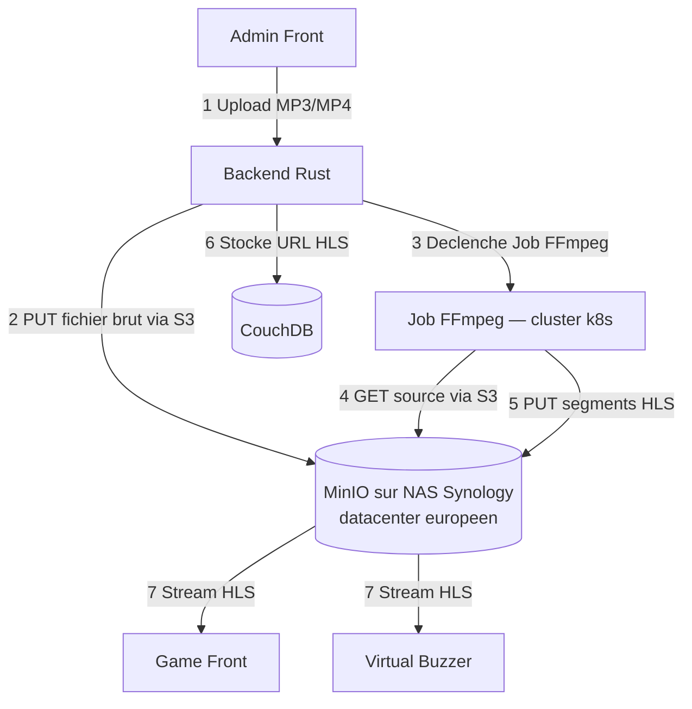

**Flux detaille :**

1. L'administrateur uploade un extrait (MP3, MP4) via l'interface admin.
2. Le backend stocke le fichier brut dans un bucket MinIO sur le NAS (`raw/`).
3. Le backend cree un `Job` Kubernetes FFmpeg en passant le chemin source et la
   destination HLS comme variables d'environnement.
4. Le Job lit le fichier brut depuis MinIO via l'API S3 (endpoint HTTPS du NAS).
5. FFmpeg encode et ecrit les segments HLS (`.m3u8` + fichiers `.ts`) dans le
   bucket MinIO (`hls/`).
6. Le backend enregistre l'URL du manifest HLS dans CouchDB.
7. Les frontends streament les segments HLS directement depuis le NAS.

**Ressources Kubernetes necessaires :**

| Ressource                        | Role                                                              |
| -------------------------------- | ----------------------------------------------------------------- |
| `Secret` credentials MinIO NAS | Endpoint, access key, secret key                                  |
| `Job` FFmpeg                   | Transcoding a la demande, cree par le backend apres chaque upload |

Le NAS n'est pas dans le cluster — aucun `StatefulSet` ni `PVC` k8s n'est requis
pour le stockage media.

**Points de vigilance :**

- Le NAS et le cluster doivent etre dans le meme datacenter ou relies par un reseau
  prive pour minimiser la latence et les couts de transfert (le Job FFmpeg peut
  transferer plusieurs centaines de Mo entre les deux) ;
- le NAS devient un point de defaillance pour le streaming : activer le RAID Synology
  (RAID 1 minimum) et surveiller la sante des disques via les alertes DSM ;
- dimensionner la bande passante sortante du NAS selon l'audience — chaque joueur
  qui streame consomme environ 128–320 kbps pour de l'audio HLS ;
- les segments HLS etant des fichiers statiques, un reverse proxy cache (Nginx) ou
  un CDN frontal peut etre ajoute devant MinIO si la charge monte.

#### Recommandation pour ce projet

**Infomaniak VOD/AOD** reste la solution recommandee pour un deploiement standard :
entierement manage, heberge en Suisse, encodage et CDN inclus, sans infrastructure
supplementaire a operer.

**Bunny Stream** est la meilleure alternative si le critere est le cout : societe
europeenne, CDN mondial, mise en place en moins d'une heure.

**NAS loue + Job FFmpeg k8s** est la solution retenue pour une souverainete totale,
avec une separation claire : le NAS stocke, le cluster transcodes. C'est le meilleur
compromis cout/controle pour un volume important de contenu video.

**Strategie multi-region** : pour un deploiement mondial, combiner un provider par zone
(Infomaniak EU + Cloudflare Stream US + Alibaba ApsaraVideo Asie) avec geo-routing via
le header `CF-IPCountry`. Le modele de donnees CouchDB stocke `url_eu`, `url_us` et
`url_asia` par media — aucun changement de schema n'est necessaire, uniquement l'ajout
de ces champs. Un Job k8s unique orchestre les uploads vers les trois providers.

#### Integration dans Kubernetes

**Services manages (Infomaniak, Bunny Stream) :**

```bash
kubectl create secret generic neon-beat-prod-vod-token \
  --namespace neon-beat \
  --from-literal=VOD_API_TOKEN='<token-infomaniak-ou-bunny>'
```

**Option NAS + Job FFmpeg :**

```bash
kubectl create secret generic neon-beat-prod-minio-nas \
  --namespace neon-beat \
  --from-literal=MINIO_ENDPOINT='https://nas.neon-beat.example.com:9000' \
  --from-literal=MINIO_ACCESS_KEY='<access-key>' \
  --from-literal=MINIO_SECRET_KEY='<secret-key>'
```

Le backend cree un `Job` k8s apres chaque upload en injectant ce `Secret` dans le
conteneur FFmpeg. Aucun autre manifeste supplementaire n'est necessaire.

Le modele de donnees actuel (`url`, `starts_at_ms`, `guess_duration_ms`, `type`) est
volontairement generique. Quelle que soit l'option retenue, la migration ne necessite
aucun changement de schema — uniquement la mise a jour des valeurs `url` dans CouchDB.

---

### 11.7 Architecture evenementielle (EDA)

#### Contexte

Neon Beat est deja un systeme oriente evenements sans en avoir l'architecture formelle.
Chaque action de jeu est par nature un evenement : un joueur buzze, une phase change,
un score est mis a jour, une equipe est validee. Ces evenements doivent etre diffuses
en temps reel a plusieurs clients simultanement (game front, admin front, buzzers).

Le probleme central identifie dans ce document — l'impossibilite de scaler le backend
horizontalement — est precisement un probleme d'architecture evenementielle non distribuee :
les evenements sont produits et consommes dans le meme processus, sans bus partage.

#### Principes de l'EDA appliques a Neon Beat

Dans une **architecture evenementielle (EDA)**, les composants ne se parlent pas
directement — ils publient et consomment des evenements via un **broker**.

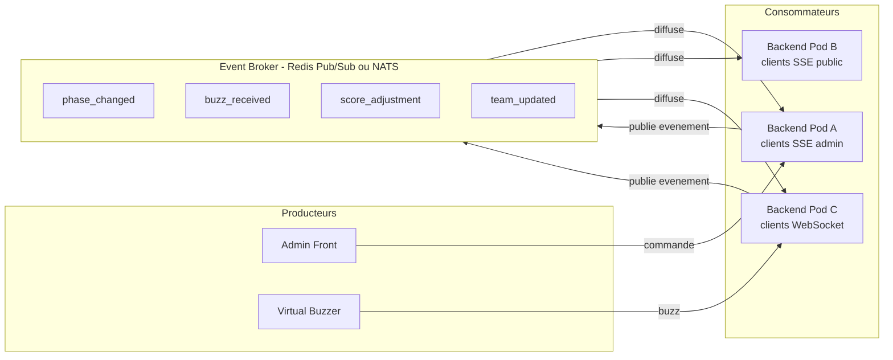

Chaque pod backend produit des evenements sur le broker et consomme tous les evenements
— il relaie ensuite les evenements a ses clients SSE ou WebSocket connectes localement.
Un joueur connecte au Pod C recoit un evenement emis par une action traitee par le Pod A.

#### Ce que cela resout pour Neon Beat

| Probleme actuel | Solution EDA |
| --------------- | ------------ |
| 1 seul replica backend (etat en memoire) | Etat partage via le broker → scaling horizontal possible |
| Evenement perdu si client sur pod different | Tous les pods recoivent tous les evenements |
| Rolling update deconnecte les clients | Les nouveaux pods consomment le broker immediatement |
| Crash backend = perte de l'etat de partie | Les evenements persistes permettent de reconstruire l'etat |

#### Event Broker recommande : Redis Pub/Sub

Redis Pub/Sub est le choix le plus simple pour debuter :

- deja utilise comme cache dans de nombreuses stacks Rust/Axum ;
- latence sub-milliseconde ;
- facile a deployer en StatefulSet Kubernetes ;
- pas de persistance des messages (suffisant pour des evenements de jeu temps reel).

NATS est une alternative plus robuste si la persistance des evenements (JetStream)
ou une garantie de livraison plus stricte devient necessaire.

#### Evolution vers CQRS

L'EDA ouvre naturellement la voie au **CQRS (Command Query Responsibility Segregation)** :
separer explicitement le traitement des commandes (buzz, changement de phase, mise a jour
du score) de la diffusion des lectures (flux SSE vers les clients).

```
Commandes (ecriture)          Evenements           Requetes (lecture)
Admin / Buzzer → Pod A  →  Event Broker  →  Pod B / Pod C → SSE clients
                               │
                               ▼
                           CouchDB
                     (Event Sourcing : log
                      des evenements de partie)
```

CQRS et Event Sourcing constituent l'architecture cible a moyen terme pour Neon Beat,
mais ne sont pas prerequis pour le deploiement initial. **L'integration d'un event broker
(Redis Pub/Sub) est la premiere etape** — elle debloque le scaling horizontal sans
necessiter de refactoring du backend.

---

## 12. Points de vigilance

Les principaux risques sont :

- latence entre regions ;
- avantage injuste pour les joueurs proches du backend ;
- coherence des buzzs en multi-replica ;
- SSE admin limite a une seule connexion ;
- gestion des WebSockets pendant les rolling updates ;
- stockage stateful CouchDB ;
- sauvegardes non testees ;
- secrets mal proteges ;
- cout d'une architecture multi-region ;
- complexite operationnelle ;
- compatibilite entre routes frontend `/admin` et routes backend `/admin/**` ;
- variables `VITE_*` figees au build ;
- divergence actuelle possible autour de la phase `pairing` / `prep_pairing` ;
- divergence actuelle entre le buzzer virtuel qui peut envoyer `select` et le backend qui accepte officiellement `identification` et `buzz`.

---

## 13. Processus de correction du code

Ce processus s'applique a chaque composant frontend avant toute mise en production.
Il est issu de l'audit de `GameManagementContext.tsx` et generalisable a l'ensemble
du code React de l'application.

Le detail des corrections pour chaque probleme identifie est documente dans
`.agents/SECURITY_AUDIT_FRONT.md`.

### 13.1 Phase d'audit

Avant de corriger, auditer le composant selon deux axes :

**Axe architecture** — questions a se poser :
- Le composant respecte-t-il le principe de responsabilite unique (SRP) ?
- Les fonctions asynchrones ont-elles toutes un try/catch ?
- Les setters internes sont-ils exposes a l'exterieur ?
- Y a-t-il du code mort (etat jamais peuple, fonctions jamais appelees) ?
- Les guards / conditions logiques ont-ils tous un fallback explicite ?

**Axe securite (OWASP)** — points a verifier :
- A01 : les entrees exterieures (JSON, formulaires) sont-elles typees et validees ?
- A03 : les donnees JSON parsees (SSE, API) sont-elles dans un try/catch ?
- A04 : les messages d'erreur exposent-ils des informations internes sensibles ?
- A08 : les valeurs du backend sont-elles castees sans validation runtime ?

### 13.2 Classification des problemes

Classer chaque probleme selon trois niveaux avant de commencer les corrections :

| Niveau | Critere | Exemples |
| ------ | ------- | -------- |
| 🔴 Critique | Crash possible, bug fonctionnel, perte de donnees | `JSON.parse` sans try/catch, guard toujours `true`, mutation sans try/catch |
| 🟠 Majeur | Vulnerabilite securite, type safety compromise | Cast `as Type` sans validation, `unknown[]` sur entrees |
| 🟡 Mineur | Dette technique, maintenabilite | God Context, setters bruts exposes, code mort |

### 13.3 Ordre de correction

Traiter dans cet ordre strict :

```
1. 🔴 Bugs fonctionnels (guards incorrects)
        ↓
2. 🔴 Crashes runtime (try/catch manquants)
        ↓
3. 🟠 Validations de donnees (casts aveuges, unknown[])
        ↓
4. 🟠 Encapsulation (setters bruts exposes)
        ↓
5. 🟡 Nettoyage (code mort)
        ↓
6. 🟡 Refactoring architectural (God Context → split)
```

Ne pas melanger les niveaux : corriger tous les 🔴 en premier, commiter, puis
passer aux 🟠. Cela permet de valider chaque serie de corrections independamment.

### 13.4 Methode de correction par type

#### Guards logiques (P01)

Remplacer tout fallback permissif (`return true`) par une whitelist explicite
des etats autorises. Cela s'applique a toutes les fonctions `canXxx()` :

```typescript
// ❌ Avant
const canPairTeams = (): boolean => {
  if (!gameState) return false;
  if (gameState === GameState.PREP_READY) return true;
  return true; // permissif
};

// ✅ Apres
const PAIRING_ALLOWED_STATES: GameState[] = [GameState.PREP_READY, GameState.PAIRING];
const canPairTeams = (): boolean => PAIRING_ALLOWED_STATES.includes(gameState as GameState);
```

#### Donnees externes : SSE et API (P02, P03, P04)

Tout `JSON.parse` ou `await apiCall()` doit etre dans un try/catch.
Tout cast `as Type` sur une valeur externe doit etre precede d'une validation :

```typescript
// Validateur generique pour les enums
function isValidEnum<T extends object>(enumObj: T, value: unknown): value is T[keyof T] {
  return Object.values(enumObj).includes(value);
}

// Usage
if (!isValidEnum(GameState, rawPhase)) return;
setGameState(rawPhase);
```

#### Validation des imports JSON (P05)

Utiliser Zod pour valider la structure des donnees avant envoi a l'API.
Ne jamais utiliser `unknown[]` comme type de payload entrant :

```typescript
import { z } from 'zod';

const QuestionSchema = z.discriminatedUnion('type', [
  z.object({ type: z.literal('blind_test'), id: z.number(), url: z.string().url(), ... }),
  z.object({ type: z.literal('multiple_choice'), id: z.number(), prompt: z.string(), ... }),
]);

const result = QuestionSchema.array().safeParse(rawData);
if (!result.success) { messageApi.error('Format invalide'); return; }
```

#### Refactoring architectural (P08)

Decouper un God Context en contextes focuss. Ordre recommande :
1. Identifier les groupes de state + actions coherents
2. Creer les nouveaux contextes un par un, en les testant independamment
3. Migrer les composants consommateurs un par un
4. Supprimer l'ancien contexte uniquement quand tous les consommateurs sont migres

Ne jamais migrer un contexte entier en un seul commit — la surface de regression
est trop grande.

### 13.5 Checklist de validation avant merge

Avant de merger une correction :

- [ ] Les guards `canXxx()` ont tous un fallback `return false` explicite
- [ ] Chaque `JSON.parse` est dans un try/catch
- [ ] Chaque `await apiCall()` est dans un try/catch avec messageApi.error
- [ ] Aucun cast `as Type` sur des donnees venant du backend sans validation runtime
- [ ] Aucun `unknown[]` comme type de payload entrant — utiliser Zod ou un type fort
- [ ] Aucun setter React brut expose dans l'interface publique d'un Context
- [ ] Le build TypeScript passe sans erreur (`tsc --noEmit`)
- [ ] Les guards sont couverts par des tests unitaires (vitest ou jest)

### 13.6 Tests unitaires

Les tests unitaires ne sont pas optionnels — ils sont le filet de securite qui permet
de corriger sans regression. Si un composant n'a pas de tests, en ecrire est la
premiere etape avant toute correction.

#### Frontend React / Vite — Vitest

Vitest est le framework de test recommande pour les projets Vite. Il s'integre
nativement sans configuration supplementaire.

Installation :
```bash
npm install -D vitest @testing-library/react @testing-library/user-event jsdom
```

Configuration minimale dans `vite.config.ts` :
```typescript
export default defineConfig({
  test: {
    environment: 'jsdom',
    globals: true,
    setupFiles: './src/test/setup.ts',
  },
});
```

**Priorites de test pour `GameManagementContext.tsx` :**

| Priorite | Ce qu'il faut tester | Pourquoi |
| -------- | -------------------- | -------- |
| 1 | Guards `canXxx()` — tous les etats | Bug P01 : `canPairTeams` toujours `true` |
| 2 | Validateur `isValidGameState` | Securite P04 : casts sans validation |
| 3 | Handlers SSE avec JSON malforme | Robustesse P02 : `JSON.parse` non protege |
| 4 | Mutations avec erreur API simulee | Robustesse P03 : try/catch manquants |

Exemple de test pour un guard :
```typescript
import { describe, it, expect } from 'vitest';
import { GameState } from '../GameManagementContext';

describe('canPairTeams', () => {
  it('retourne false sans gameState', () => {
    expect(canPairTeams(undefined)).toBe(false);
  });
  it('retourne true en PREP_READY', () => {
    expect(canPairTeams(GameState.PREP_READY)).toBe(true);
  });
  it('retourne false en PLAYING', () => {
    expect(canPairTeams(GameState.PLAYING)).toBe(false);
  });
});
```

Commande de test :
```bash
npm run test          # mode watch
npm run test -- --run # mode CI (une seule passe)
npm run test -- --coverage # avec rapport de couverture
```

Objectif de couverture minimal : **80 % des branches** sur les guards et validateurs.

#### Backend Rust / Axum — cargo test

Rust integre les tests unitaires nativement. Pas de dependance supplementaire.

```rust
#[cfg(test)]
mod tests {
    use super::*;

    #[test]
    fn phase_transition_playing_to_paused() {
        let state = GameState::Playing;
        assert!(state.can_pause());
        assert!(!state.can_resume());
    }
}
```

Tests d'integration pour les endpoints Axum :
```bash
cargo test                    # tous les tests
cargo test phase_transition   # filtrer par nom
cargo test -- --nocapture     # afficher les logs
```

---

## 14. Plan de refactoring — Separation des responsabilites

Ce plan propose un decoupage coherent pour chaque microservice, base sur le
**principe de responsabilite unique (SRP)** et les principes **DRY** (Don't Repeat
Yourself). Les schemas montrent l'etat apres refactoring.

Principe directeur : **composition plutot qu'heritage**. Dans ce projet TypeScript/
React et Rust, on prefere des hooks qui composent d'autres hooks, des traits injectes
(Rust), et des fonctions utilitaires pures partagees.

### 14.1 Backend Rust — `neon-beat-back`

#### Etat actuel — modules God

Les fichiers principaux cumulent orchestration, persistance, SSE, transitions d'etat
et validation dans un meme module :

| Fichier | Lignes | Responsabilites melangees |
|---|---|---|
| `state/mod.rs` | 1097 | Etat global + persistance + debouncing + SSE + transitions |
| `services/admin_service.rs` | 1244 | Coordination + persistance + machine d'etat + broadcasting |
| `services/game_service.rs` | 703 | Construction + creation + chargement + validation |
| `services/websocket_service.rs` | 485 | Gestion WS + pairing + transitions + envoi |
| `state/state_machine.rs` | 528 | Definition + transitions + phases |
| `routes/admin.rs` | 594 | Routing HTTP + validation headers + handlers metier |

#### Schema apres refactoring

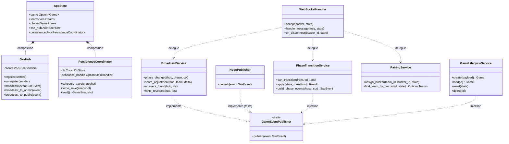

Le trait `GameEventPublisher` est injecte dans les services — en tests, on injecte
`NoopPublisher` sans avoir besoin d'un vrai SSE.

#### Structure de fichiers cible

```
src/
├── state/
│   ├── mod.rs              — AppState (struct + new())
│   ├── sse_hub.rs          — SseHub : register / broadcast
│   └── persistence.rs      — PersistenceCoordinator : debounce + save/load
├── services/
│   ├── phase_transition.rs — Transitions d'etat (logique pure)
│   ├── game_lifecycle.rs   — CRUD jeux
│   ├── broadcast.rs        — Construction + envoi SSE
│   ├── pairing.rs          — Logique buzzer-equipe
│   └── websocket.rs        — Handler WS (accept + dispatch)
├── routes/
│   ├── admin.rs            — Routing HTTP uniquement
│   └── public.rs
└── domain/
    ├── game.rs             — structs Game, Team, Question, Answer
    ├── phase.rs            — enum GamePhase + StateMachine
    └── events.rs           — structs SseEvent, WsMessage (types purs)
```

---

### 14.2 Admin Front — `neon-beat-admin-front`

#### Etat actuel

| Fichier | Lignes | Responsabilites melangees |
|---|---|---|
| `Context/ApiContext.tsx` | 559 | SSE + tokens + helpers HTTP + CRUD API |
| `Context/GameManagementContext.tsx` | 553 | Etat + SSE handlers + logique metier + appels API |
| `Components/GameController.tsx` | 150 | Rendu + handlers metier + appels API |
| `Components/SongController.tsx` | 142 | Rendu + logique 3 types de questions + API |
| `Components/GameCreator.tsx` | 125 | Formulaire + validation + appels API |
| `Components/AdminHome.tsx` | 108 | Orchestration + extraction ID YouTube + rendu conditionnel |

#### Schema apres refactoring — Contextes

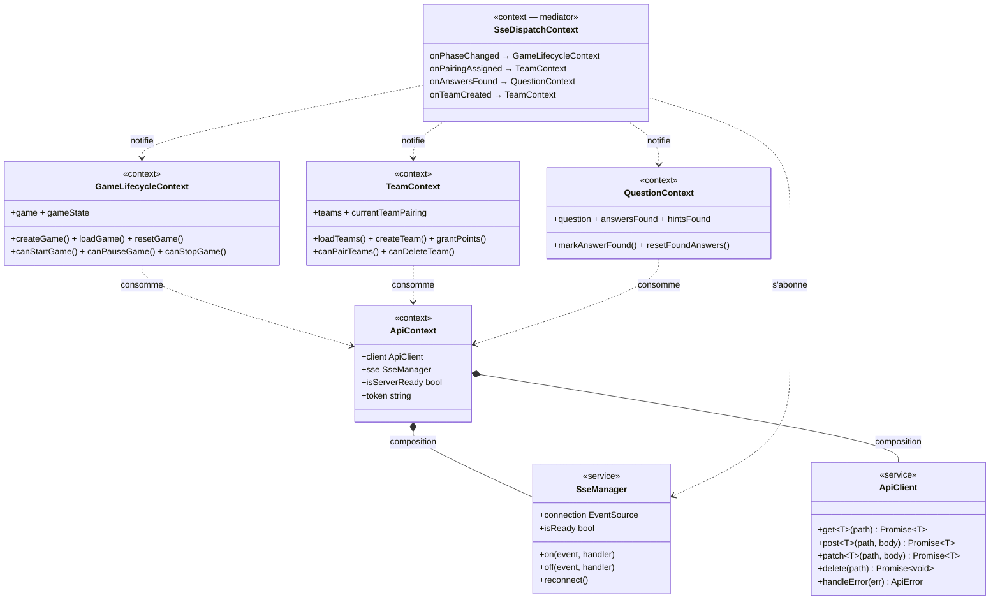

#### Arbre des providers React

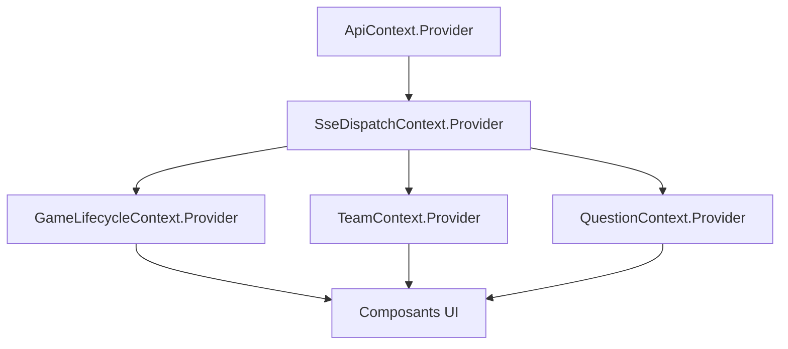

#### Schema apres refactoring — Composants

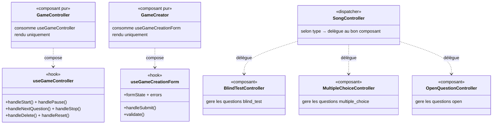

#### Structure de fichiers cible

```
src/
├── services/
│   ├── ApiClient.ts            — fetch wrapper + gestion erreurs
│   └── SseManager.ts           — EventSource + reconnexion
├── Context/
│   ├── ApiContext.tsx
│   ├── GameLifecycleContext.tsx
│   ├── TeamContext.tsx
│   ├── QuestionContext.tsx
│   └── SseDispatchContext.tsx
├── hooks/
│   ├── useGameController.ts
│   ├── useGameCreationForm.ts
│   └── useSongController.ts
├── utils/
│   ├── parseSseEvent.ts        — DRY partagé (voir 14.5)
│   ├── validateGameState.ts    — isValidGameState()
│   └── youtubeUtils.ts         — extractYoutubeId()
└── Components/
    ├── GameController.tsx      — rendu pur
    ├── GameCreator.tsx         — rendu pur
    └── SongController/
        ├── index.tsx           — dispatcher
        ├── BlindTestController.tsx
        ├── MultipleChoiceController.tsx
        └── OpenQuestionController.tsx
```

---

### 14.3 Game Front — `neon-beat-game-front`

#### Etat actuel

| Fichier | Lignes | Responsabilites melangees |
|---|---|---|
| `hooks/useNeonBeatPublic.tsx` | 300 | SSE + etat jeu + handlers + API + logique audio |
| `App.tsx` | 222 | Routing + fade audio (timers) + etat jeu |
| `components/Quizz/QuizzGame.tsx` | 62 | Rendu + 2 fonctions de transformation de donnees |

#### Schema apres refactoring

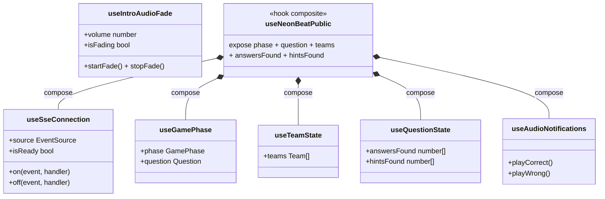

#### Structure de fichiers cible

```
src/
├── hooks/
│   ├── useSseConnection.ts
│   ├── useGamePhase.ts
│   ├── useTeamState.ts
│   ├── useQuestionState.ts
│   ├── useAudioNotifications.ts
│   ├── useIntroAudioFade.ts
│   └── useNeonBeatPublic.ts   — hook composite
├── utils/
│   ├── parseSseEvent.ts       — DRY partagé
│   └── quizzUtils.ts          — derivePropositions(), deriveOpenFoundAnswers()
└── components/
    ├── App.tsx                — routing pur, consomme useIntroAudioFade
    └── Quizz/
        └── QuizzGame.tsx      — rendu pur, logique extraite dans quizzUtils
```

---

### 14.4 Virtual Buzzer — `neon-beat-virtual-buzzer`

#### Etat actuel

| Fichier | Lignes | Responsabilites melangees |
|---|---|---|
| `hooks/usePublicSse.ts` | 220 | SSE + parsing JSON + normalisation couleurs + upsert equipes |
| `hooks/useBuzzerWs.ts` | 107 | WS + retry/reconnexion + serialisation + handlers |

#### Schema apres refactoring

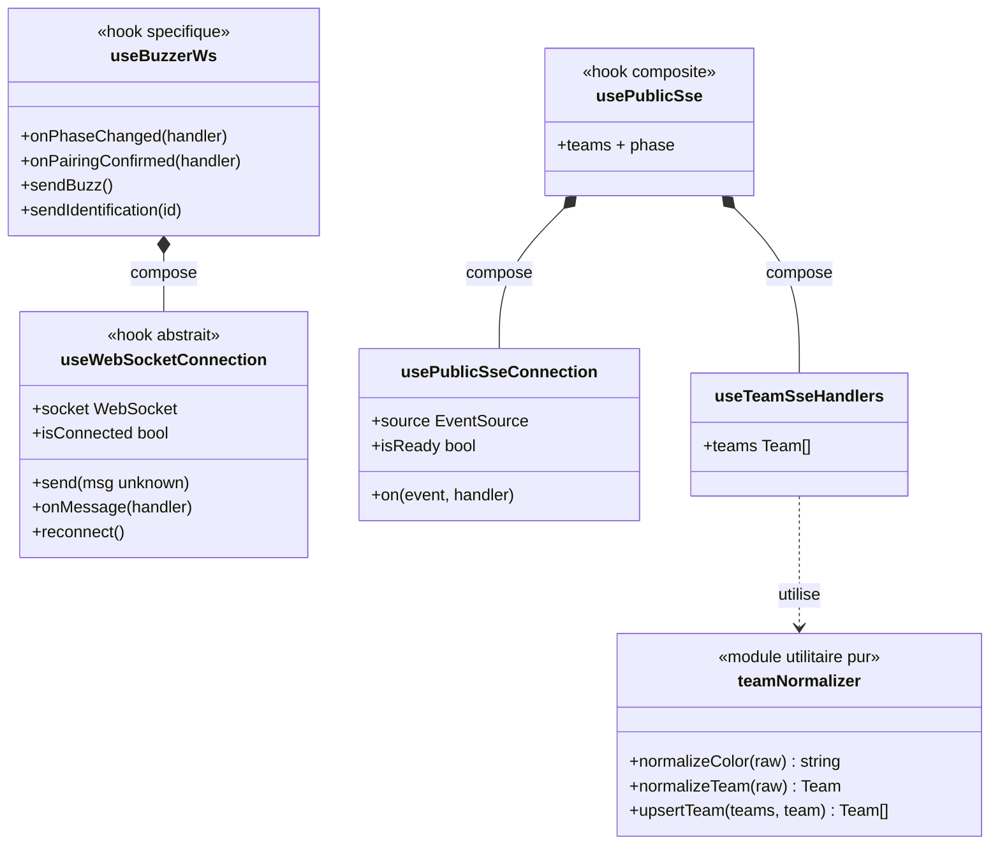

#### Structure de fichiers cible

```
src/
├── hooks/
│   ├── useWebSocketConnection.ts  — WS abstrait + reconnexion
│   ├── useBuzzerWs.ts             — logique buzzer
│   ├── usePublicSseConnection.ts  — SSE abstrait
│   ├── useTeamSseHandlers.ts      — handlers equipes
│   └── usePublicSse.ts            — hook composite
└── utils/
    └── teamNormalizer.ts          — fonctions pures de normalisation
```

---

### 14.5 Code transversal partagé (DRY)

Trois patterns sont reimplementes dans chaque service sans abstraction commune.

#### parseSseEvent — duplique x3 frontends

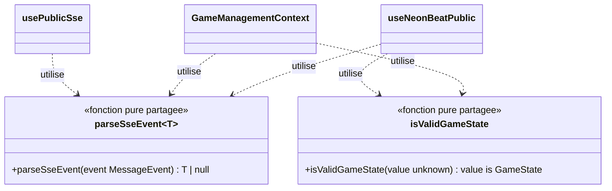

#### useEventSourceWithRetry — reconnexion SSE dupliquee x3

```typescript
// utils/useEventSourceWithRetry.ts — hook generique partage
function useEventSourceWithRetry(url: string, options?: {
  maxRetries?: number;
  backoffMs?: number;
}): { source: EventSource | null; isReady: boolean; reconnect: () => void }
```

**Option de partage** : si les repos restent independants, dupliquer ces utilitaires
dans un dossier `utils/shared/` de chaque repo. Si un monorepo est envisage
(Turborepo ou pnpm workspaces), les extraire dans un package `@neon-beat/shared`.

---

### 14.6 Recapitulatif des patterns appliques

| Pattern | Ou applique | Justification |
|---|---|---|
| **Composition de hooks** | Tous les frontends | Hook composite = assemblage de hooks specialises |
| **Trait + injection (Rust)** | `GameEventPublisher` dans les services | Testabilite sans SSE reel |
| **Mediator / Dispatcher** | `SseDispatchContext` | Route les events SSE sans couplage direct |
| **Adapter** | `ApiClient` | Isole `fetch()` du reste de l'application |
| **Factory / Builder** | `QuestionSequenceBuilder` (Rust) | Construction complexe de modeles |
| **Fonctions pures** | `parseSseEvent`, `teamNormalizer`, `quizzUtils` | Sans effet de bord, testables unitairement |

---

## 15. Integration continue (CI)

Un workflow CI est mis en place sur chaque depot. Il valide automatiquement
a chaque push que le code compile, passe le linter et les tests.

### 15.1 Strategie de branches et declenchement

| Branche | Signification | CI declenche |
| ------- | ------------- | ------------ |
| `main` | Production | Oui — tous les jobs |
| `preprod` | Pre-production | Oui — tous les jobs |
| `dev_back_*` | Feature backend | Oui — backend uniquement |
| `dev_front_*` | Feature frontend | Oui — frontend concerne |
| `devops/*` | Infrastructure k8s | Oui — validation YAML |
| `feat/*`, `fix/*` | Feature generique | Oui — tous les jobs |

### 15.2 CI — Frontends React/Vite

**S'applique a :** `neon-beat-admin-front`, `neon-beat-game-front`, `neon-beat-virtual-buzzer`

Outil | Role
--- | ---
ESLint + typescript-eslint | Linter TypeScript
`tsc --noEmit` | Verification des types sans build
Vitest | Tests unitaires
Vite build | Verification que le bundle compile

```yaml
name: CI

on:
  push:
    branches:
      - main
      - preprod
      - 'dev_front_*'
      - 'feat/*'
      - 'fix/*'

permissions:
  contents: read

jobs:
  test_and_lint:
    runs-on: ubuntu-latest
    steps:
      - name: Checkout
        uses: actions/checkout@v4

      - name: Setup Node.js
        uses: actions/setup-node@v4
        with:
          node-version: 22
          cache: npm

      - name: Install dependencies
        run: npm ci

      - name: TypeScript check
        run: npx tsc --noEmit

      - name: Lint (ESLint)
        run: npm run lint

      - name: Tests unitaires (Vitest)
        run: npm run test -- --run

      - name: Build
        run: npm run build
        env:
          VITE_API_BASE_URL: https://api.neon-beat.example.com
```

> La variable `VITE_API_BASE_URL` doit etre definie en CI pour que Vite puisse
> construire le bundle. Utiliser une valeur de substitution — le build CI ne sert
> qu'a verifier l'absence d'erreur de compilation, pas a produire une image deployee.

### 15.3 CI — Backend Rust/Axum

**S'applique a :** `neon-beat-back`

Outil | Role
--- | ---
`cargo fmt --check` | Verification du formatage (rustfmt)
`cargo clippy -- -D warnings` | Linter Rust, echec si avertissement
`cargo test` | Tests unitaires et d'integration
`cargo build --release` | Verification que le build de production compile

```yaml
name: CI

on:
  push:
    branches:
      - main
      - preprod
      - 'dev_back_*'
      - 'feat/*'
      - 'fix/*'

permissions:
  contents: read

jobs:
  test_and_lint:
    runs-on: ubuntu-latest
    steps:
      - name: Checkout
        uses: actions/checkout@v4

      - name: Setup Rust
        uses: dtolnay/rust-toolchain@stable
        with:
          components: clippy, rustfmt

      - name: Cache cargo
        uses: actions/cache@v4
        with:
          path: |
            ~/.cargo/registry
            ~/.cargo/git
            target/
          key: ${{ runner.os }}-cargo-${{ hashFiles('**/Cargo.lock') }}

      - name: Format check
        run: cargo fmt --check

      - name: Lint (Clippy)
        run: cargo clippy -- -D warnings

      - name: Tests
        run: cargo test

      - name: Build release
        run: cargo build --release
```

### 15.4 CI — Manifestes Kubernetes

**S'applique a :** `k8s_neon_beat` (ce depot)

Outil | Role
--- | ---
yamllint | Lint syntaxique et style des fichiers YAML
kubeconform | Validation des manifestes contre les schemas k8s officiels

```yaml
name: CI

on:
  push:
    branches:
      - main
      - preprod
      - 'devops/*'

permissions:
  contents: read

jobs:
  validate:
    runs-on: ubuntu-latest
    steps:
      - name: Checkout
        uses: actions/checkout@v4

      - name: Install yamllint
        run: pip install yamllint

      - name: Lint YAML
        run: yamllint k8s/

      - name: Install kubeconform
        run: |
          curl -L https://github.com/yannh/kubeconform/releases/latest/download/kubeconform-linux-amd64.tar.gz \
            | tar xz
          sudo mv kubeconform /usr/local/bin/

      - name: Validate manifestes Kubernetes
        run: |
          find k8s/ -name '*.yml' \
            -not -name '*.example.yml' \
            -not -name 'cloudflare-secret.yml' \
            | xargs kubeconform \
                -strict \
                -ignore-missing-schemas \
                -kubernetes-version 1.28.0
```

> Les fichiers `*.example.yml` et `cloudflare-secret.yml` sont exclus de la
> validation — ils contiennent des valeurs de substitution non conformes au schema.

### 15.5 Checklist CI avant merge

- [ ] Le workflow CI est present dans le depot (`.github/workflows/ci.yml`)
- [ ] Le CI passe en vert sur la branche avant merge
- [ ] Les tests unitaires couvrent au minimum les guards et validateurs
- [ ] Le linter ne retourne aucune erreur (`-D warnings` pour Rust, lint script pour TS)
- [ ] Le build compile sans erreur
- [ ] Aucun secret reel dans les variables d'environnement du workflow

---

## 16. Processus de deploiement

Ce processus s'applique a chaque mise en production. Il suit le principe
**preprod d'abord, prod ensuite**, avec validation a chaque etape.

### 16.1 Prerequisites

Verifier avant tout deploiement :

```bash
# Cluster accessible
kubectl cluster-info

# Namespaces presents
kubectl get namespace neon-beat
kubectl get namespace neon-beat-preprod

# cert-manager operationnel
kubectl get pods -n cert-manager
kubectl get clusterissuer

# Ingress NGINX present
kubectl get ingressclass nginx
```

### 16.2 Construction et publication des images

Pour chaque composant modifie (`back`, `admin-front`, `game-front`, `virtual-buzzer`) :

```bash
# Build de l'image
docker build -t ghcr.io/neon-beat/neon-beat-back:preprod ./neon-beat-back

# Push vers GitHub Container Registry
docker push ghcr.io/neon-beat/neon-beat-back:preprod
```

Convention de tag : `ghcr.io/neon-beat/{composant}:{env}`

- `preprod` pour la pre-production
- `prod` pour la production
- `vX.Y.Z` pour les releases versionnees (recommande en production)

### 16.3 Deploiement pre-production

Toujours deployer en preprod en premier pour valider le comportement avant prod.

```bash
# 1. Secrets (si premier deploiement ou rotation)
kubectl create secret generic neon-beat-preprod-secrets \
  --namespace neon-beat-preprod \
  --from-literal=COUCH_USERNAME=admin \
  --from-literal=COUCH_PASSWORD='<mot-de-passe-preprod>' \
  --dry-run=client -o yaml | kubectl apply -f -

# 2. Configuration
kubectl apply -f k8s/preprod/namespace.yml
kubectl apply -f k8s/preprod/configmap.yml
kubectl apply -f k8s/preprod/

# 3. Surveiller le rollout
kubectl rollout status deployment/neon-beat-preprod-back -n neon-beat-preprod
kubectl get pods -n neon-beat-preprod -w
```

**Validation preprod — tests a effectuer :**

| Test | Commande / Action |
| ---- | ----------------- |
| Pods en Running | `kubectl get pods -n neon-beat-preprod` |
| Certificat TLS valide | `kubectl get certificate -n neon-beat-preprod` |
| API accessible | `curl https://preprod-api.neon-beat.example.com/healthcheck` |
| SSE admin fonctionnel | Ouvrir l'admin front, verifier la connexion SSE |
| Buzzer pairable | Connecter un buzzer virtuel, verifier le pairing |
| CouchDB accessible | `kubectl port-forward svc/neon-beat-preprod-couchdb 5984:5984 -n neon-beat-preprod` |

Ne passer a la prod qu'apres validation complete de tous ces points.

### 16.4 Deploiement production

```bash
# 1. Secrets (si rotation)
kubectl create secret generic neon-beat-prod-secrets \
  --namespace neon-beat \
  --from-literal=COUCH_USERNAME=admin \
  --from-literal=COUCH_PASSWORD='<mot-de-passe-prod>' \
  --dry-run=client -o yaml | kubectl apply -f -

# 2. Configuration et securite
kubectl apply -f k8s/namespace.yml
kubectl apply -f k8s/prod/configmap.yml
kubectl apply -f k8s/prod/network-policy.yml
kubectl apply -f k8s/prod/pdb.yml

# 3. Workloads
kubectl apply -f k8s/prod/deployment.yml
kubectl apply -f k8s/prod/service.yml

# 4. Exposition
kubectl apply -f k8s/prod/ingress.yml

# 5. Autoscaling et sauvegardes
kubectl apply -f k8s/prod/hpa.yml
kubectl apply -f k8s/prod/backup-cronjob.yml

# 6. Cert-manager (si premier deploiement)
kubectl apply -f k8s/cert-manager/
```

Ordre important : appliquer `network-policy.yml` et `pdb.yml` **avant** les
workloads pour que les politiques soient actives des le premier pod.

### 16.5 Validation post-deploiement production

```bash
# Etat general
kubectl get pods -n neon-beat -o wide
kubectl get ingress -n neon-beat
kubectl get certificate -n neon-beat
kubectl get hpa -n neon-beat

# Logs backend (surveiller 2-3 minutes)
kubectl logs -f -n neon-beat -l app.kubernetes.io/name=neon-beat-back

# Verification certificat TLS
kubectl describe certificate neon-beat-prod-api-tls -n neon-beat
```

**Checklist post-deploiement :**

- [ ] Tous les pods en `Running` (pas de `CrashLoopBackOff`)
- [ ] `certificate.status.conditions[0].status = True`
- [ ] API repond sur `https://api.neon-beat.example.com/healthcheck`
- [ ] Frontend accessible sur `https://neon-beat.example.com`
- [ ] `/admin` charge l'interface d'administration
- [ ] `/buzzer` charge le buzzer virtuel
- [ ] HPA correctement configure : `kubectl get hpa -n neon-beat`
- [ ] CronJob backup present : `kubectl get cronjob -n neon-beat`
- [ ] NetworkPolicy active : `kubectl get networkpolicy -n neon-beat`

### 16.6 Procedure de rollback

En cas de probleme apres un deploiement :

```bash
# Rollback d'un Deployment specifique
kubectl rollout undo deployment/neon-beat-prod-back -n neon-beat

# Rollback de tous les Deployments
kubectl rollout undo deployment -n neon-beat

# Verifier l'historique des rollouts
kubectl rollout history deployment/neon-beat-prod-back -n neon-beat

# Revenir a une revision specifique
kubectl rollout undo deployment/neon-beat-prod-back \
  --to-revision=2 -n neon-beat
```

> CouchDB (StatefulSet) n'est pas concerne par le rollback applicatif.
> En cas de corruption de donnees CouchDB, utiliser la procedure de restauration
> depuis le backup (voir section Sauvegardes du README).

### 16.7 Mise a jour d'une image uniquement (rolling update)

Pour une mise a jour sans reappliquer tous les manifestes :

```bash
# Mettre a jour une image specifique
kubectl set image deployment/neon-beat-prod-back \
  backend=ghcr.io/neon-beat/neon-beat-back:v1.2.3 \
  -n neon-beat

# Surveiller le rolling update
kubectl rollout status deployment/neon-beat-prod-back -n neon-beat
```

Le rolling update respecte automatiquement le `PodDisruptionBudget` :
au moins 1 pod frontend reste disponible pendant la mise a jour.

### 16.8 Rotation des secrets

Ne jamais modifier un Secret en place avec `kubectl edit` — utiliser `--dry-run | apply` :

```bash
kubectl create secret generic neon-beat-prod-secrets \
  --namespace neon-beat \
  --from-literal=COUCH_USERNAME=admin \
  --from-literal=COUCH_PASSWORD='<nouveau-mot-de-passe>' \
  --dry-run=client -o yaml | kubectl apply -f -

# Redemarrer le backend pour prendre en compte le nouveau secret
kubectl rollout restart deployment/neon-beat-prod-back -n neon-beat
```

---

## 17. Conclusion

La strategie proposee permet de transformer Neon Beat en une plateforme plus robuste, scalable et exploitable.

Pour un TP ou une premiere mise en production, l'approche recommandee est :

- cluster Kubernetes mono-region ou multi-zone ;
- backend Rust expose via Ingress ;
- CouchDB en StatefulSet avec volume persistant ;
- frontends servis sous `/`, `/admin` et `/buzzer` ;
- TLS active ;
- monitoring minimal ;
- backups automatises ;
- un seul replica backend tant que l'etat temps reel n'est pas synchronise entre pods.

Pour une architecture mondiale avancee, il faudra ajouter :

- CDN global ;
- routage geographique ;
- event bus Redis Pub/Sub ou NATS (prerequis au scaling du backend) ;
- strategie de region autoritative par partie ;
- replication de base ;
- observabilite complete ;
- securite admin renforcee ;
- CQRS comme etape suivante apres l'event broker ;
- providers VOD par region (Infomaniak EU / Cloudflare Stream US / Alibaba Asia)
  avec geo-routing CF-IPCountry et modele CouchDB multi-URL.

Kubernetes fournit la base d'orchestration. Les deux chantiers prioritaires pour
la mise a l'echelle mondiale sont : l'integration d'un event broker (EDA, section 11.7)
pour lever la contrainte replicas=1 sur le backend, et la strategie VOD multi-region
(section 11.6) pour garantir la disponibilite et la souverainete des medias par zone.
