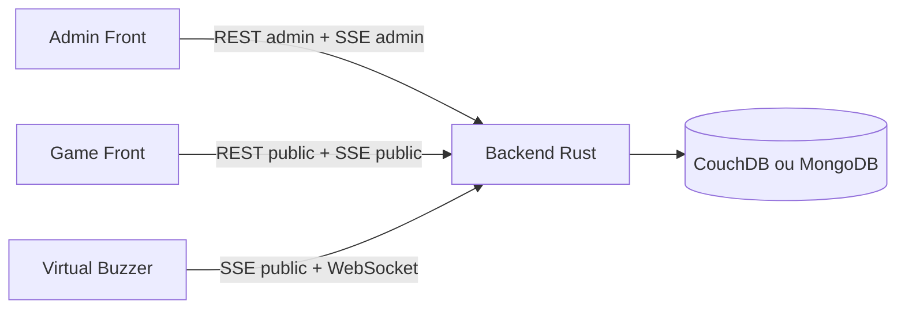
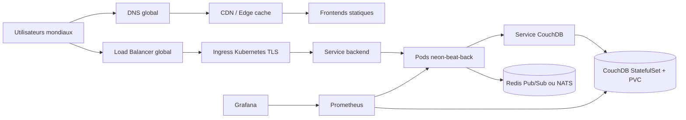
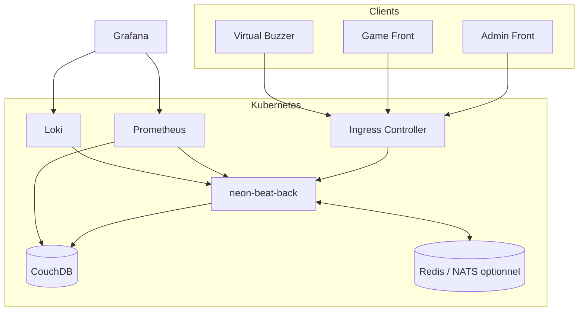
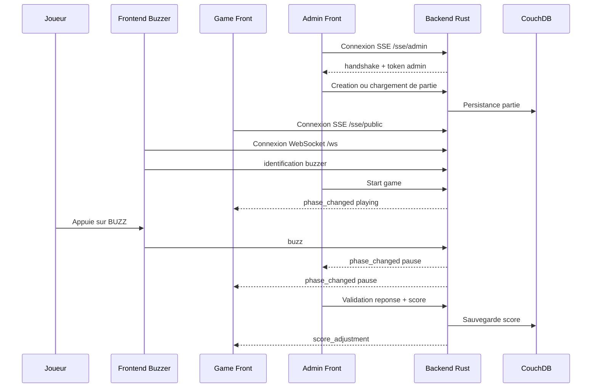
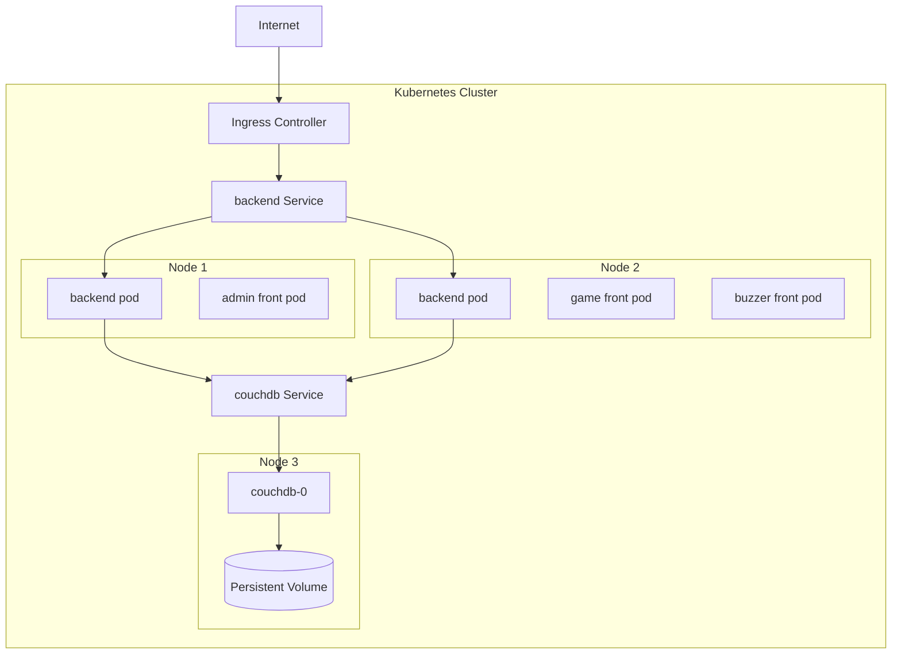
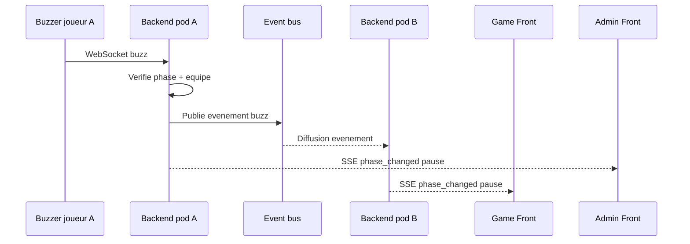
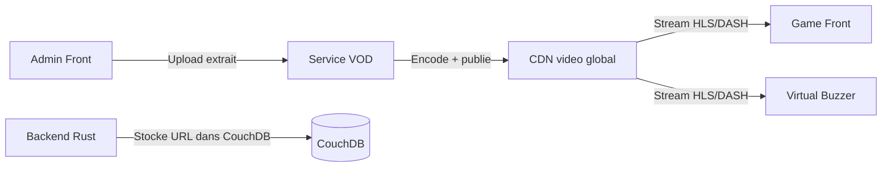
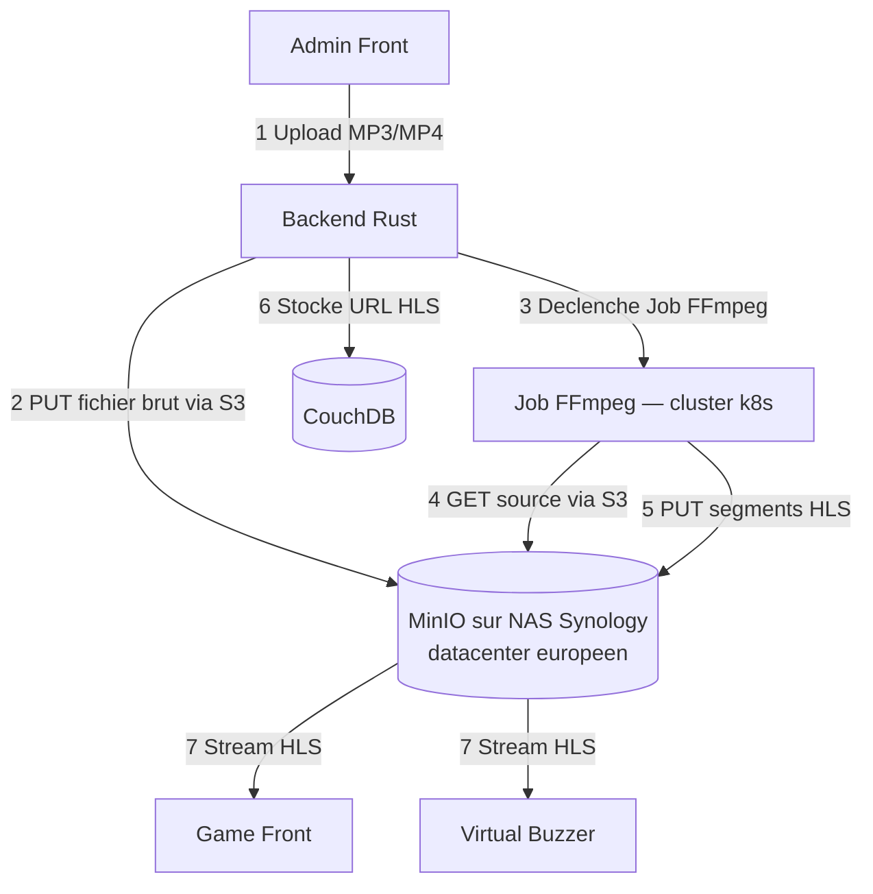

# Document d'architecture - Deploiement global de Neon Beat

## Sommaire

- [1. Introduction](#1-introduction)
  - [1.1 Contexte du projet](#11-contexte-du-projet)
  - [1.2 Objectifs](#12-objectifs)
  - [1.3 Hypotheses retenues](#13-hypotheses-retenues)
- [2. Analyse de la problematique](#2-analyse-de-la-problematique)
  - [2.1 Architecture actuelle](#21-architecture-actuelle)
  - [2.2 Limites du modele On Premise](#22-limites-du-modele-on-premise)
  - [2.3 Limites specifiques a Neon Beat](#23-limites-specifiques-a-neon-beat)
- [3. Points critiques identifies](#3-points-critiques-identifies)
  - [3.1 Temps reel](#31-temps-reel)
  - [3.2 Latence mondiale](#32-latence-mondiale)
  - [3.3 Base de donnees](#33-base-de-donnees)
  - [3.4 Scalabilite](#34-scalabilite)
  - [3.5 Securite](#35-securite)
- [4. Architecture cible proposee](#4-architecture-cible-proposee)
  - [4.1 Vue globale](#41-vue-globale)
  - [4.2 Choix d'infrastructure](#42-choix-dinfrastructure)
  - [4.3 Modele de deploiement recommande](#43-modele-de-deploiement-recommande)
  - [4.4 Composants Kubernetes utilises](#44-composants-kubernetes-utilises)
- [5. Schemas d'architecture](#5-schemas-darchitecture)
  - [5.1 Schema de composants](#51-schema-de-composants)
  - [5.2 Schema de flux utilisateur](#52-schema-de-flux-utilisateur)
  - [5.3 Schema de deploiement Kubernetes](#53-schema-de-deploiement-kubernetes)
  - [5.4 Schema de sequence temps reel](#54-schema-de-sequence-temps-reel)
- [6. Scalabilite et resilience](#6-scalabilite-et-resilience)
  - [6.1 Scalabilite horizontale](#61-scalabilite-horizontale)
  - [6.2 Resilience](#62-resilience)
  - [6.3 Base de donnees](#63-base-de-donnees)
  - [6.4 Haute disponibilite multi-region](#64-haute-disponibilite-multi-region)
- [7. Securite](#7-securite)
  - [7.1 Securite reseau](#71-securite-reseau)
  - [7.2 Gestion des secrets](#72-gestion-des-secrets)
  - [7.3 Securite applicative](#73-securite-applicative)
  - [7.4 RBAC Kubernetes](#74-rbac-kubernetes)
- [8. Monitoring et observabilite](#8-monitoring-et-observabilite)
  - [8.1 Metriques](#81-metriques)
  - [8.2 Logs](#82-logs)
  - [8.3 Alerting](#83-alerting)
  - [8.4 Tracing](#84-tracing)
- [9. Gestion du temps reel](#9-gestion-du-temps-reel)
  - [9.1 Problematique](#91-problematique)
  - [9.2 Solution proposee](#92-solution-proposee)
  - [9.3 Point de vigilance](#93-point-de-vigilance)
  - [9.4 Configuration Ingress recommandee](#94-configuration-ingress-recommandee)
- [10. Fichiers de configuration fournis dans le ZIP](#10-fichiers-de-configuration-fournis-dans-le-zip)
  - [10.1 Variables de configuration Kubernetes](#101-variables-de-configuration-kubernetes)
- [11. Justification des choix techniques](#11-justification-des-choix-techniques)
  - [11.1 Kubernetes](#111-kubernetes)
  - [11.2 CDN](#112-cdn)
  - [11.3 CouchDB](#113-couchdb)
  - [11.4 Redis Pub/Sub ou NATS](#114-redis-pubsub-ou-nats)
  - [11.5 Monitoring](#115-monitoring)
  - [11.6 Media audio/video et service VOD](#116-media-audiovideo-et-service-vod)
- [12. Points de vigilance](#12-points-de-vigilance)
- [12.bis Correspondance avec la grille d'evaluation TP](#12bis-correspondance-avec-la-grille-devaluation-tp)
- [13. Conclusion](#13-conclusion)

---

## 1. Introduction

### 1.1 Contexte du projet

Neon Beat est une application de blind test et de quiz musical temps reel. Elle permet a un administrateur de piloter une partie, a un ecran public d'afficher l'etat du jeu, et a des joueurs d'interagir via des buzzers physiques ou virtuels.

L'application est aujourd'hui composee de plusieurs microservices ou depots applicatifs :

| Composant                    | ComposantRo                                                               | Technologie principale    |
| ---------------------------- | ------------------------------------------------------------------------- | ------------------------- |
| `neon-beat-back`           | Backend central, API REST, WebSocket, SSE, logique de partie, persistance | Rust / Axum               |
| `neon-beat-admin-front`    | Interface d'administration pour le game master                            | React / Vite / Ant Design |
| `neon-beat-game-front`     | Interface publique affichant questions, blindtest, quiz et scores         | React / Vite              |
| `neon-beat-virtual-buzzer` | Buzzer web virtuel pour les joueurs                                       | React / Vite              |
| `neon-beat-docs`           | Documentation et diagrammes d'architecture                                | Markdown / PlantUML       |
| CouchDB ou MongoDB           | Stockage des parties, equipes, sequences de questions                     | Base documentaire         |

L'objectif de ce document est de proposer une architecture cible permettant de deployer Neon Beat a l'echelle mondiale, avec de bonnes performances, une meilleure disponibilite et une exploitation plus fiable.

### 1.2 Objectifs

Les objectifs principaux sont :

- deployer l'application a l'echelle mondiale ;
- reduire la latence percue par les joueurs ;
- garantir une haute disponibilite des composants critiques ;
- securiser les echanges entre clients, backend et base de donnees ;
- permettre la scalabilite automatique ;
- superviser l'etat de la plateforme ;
- faciliter les deploiements et les mises a jour ;
- preparer une architecture compatible avec Kubernetes.

### 1.3 Hypotheses retenues

Pour rester realiste, l'architecture distingue deux niveaux :

- une architecture cible pragmatique pour un TP ou un MVP : un cluster Kubernetes principal, un stockage persistant, des frontends servis statiquement, un backend scalable sous conditions ;
- une architecture mondiale avancee : CDN global, multi-zone, event bus pour le temps reel, replication de base et eventuellement multi-region.

Le point le plus sensible est le temps reel. Une partie Neon Beat doit rester coherente : le premier buzz, l'etat de la question, les scores et les transitions de phase doivent etre traites dans un ordre controle.

---

## 2. Analyse de la problematique

### 2.1 Architecture actuelle

L'architecture actuelle repose sur :

- un backend Rust expose sur HTTP ;
- des endpoints REST publics et admin ;
- des flux Server-Sent Events :
  - `/sse/public` pour les frontends publics et buzzers virtuels ;
  - `/sse/admin` pour l'interface administrateur ;
- un WebSocket `/ws` pour les buzzers ;
- une base CouchDB ou MongoDB ;
- trois frontends Vite :
  - `/admin` pour l'administration ;
  - `/buzzer` pour les buzzers virtuels ;
  - le game front pour l'affichage public.

Schema simplifie :



### 2.2 Limites du modele On Premise

Un deploiement On Premise ou mono-machine presente plusieurs limites :

- scalabilite limitee ;
- faible tolerance aux pannes ;
- maintenance et mises a jour plus difficiles ;
- exposition internet et TLS a gerer manuellement ;
- monitoring souvent incomplet ;
- sauvegardes moins automatisees ;
- latence elevee pour les joueurs geographiquement eloignes ;
- risque de coupure totale si le serveur unique tombe.

### 2.3 Limites specifiques a Neon Beat

Neon Beat utilise beaucoup de temps reel. Cela cree des contraintes particulieres :

- les connexions SSE sont longues ;
- les connexions WebSocket doivent rester stables ;
- le backend conserve de l'etat de partie en memoire ;
- le flux admin SSE est limite a une seule connexion ;
- plusieurs replicas backend peuvent diverger si aucun bus d'evenements ou stockage partage n'est utilise pour synchroniser l'etat temps reel.

---

## 3. Points critiques identifies

### 3.1 Temps reel

Le temps reel est critique pour Neon Beat car il synchronise :

- l'etat de la partie ;
- la question courante ;
- les buzzers ;
- les phases de jeu ;
- les scores ;
- les validations de reponse ;
- l'affichage public ;
- l'interface administrateur.

Un delai trop important ou un evenement perdu peut provoquer une mauvaise experience : buzz non pris en compte, score incoherent, affichage public en retard, ou admin desynchronise.

### 3.2 Latence mondiale

Si tous les joueurs se connectent a une seule region, les joueurs eloignes peuvent subir une latence importante.

Exemple :

- un backend heberge en Europe ;
- des joueurs en Amerique du Sud ou en Asie ;
- les buzzers doivent traverser une grande distance reseau ;
- un joueur proche du serveur peut etre avantage par rapport a un joueur eloigne.

Pour un jeu base sur le buzz, cette latence est un point fonctionnel important, pas seulement un probleme de confort.

### 3.3 Base de donnees

La base de donnees stocke les parties, equipes, scores et sequences de questions. Les enjeux sont :

- disponibilite ;
- persistance des donnees ;
- sauvegardes ;
- restauration ;
- replication ;
- coherence ;
- performance en ecriture lors des changements de score ou d'etat.

CouchDB est interessant pour Neon Beat car il supporte un modele documentaire et de la replication. MongoDB est aussi supporte par le backend, mais le template cible principalement CouchDB.

### 3.4 Scalabilite

Les composants a scaler ne se comportent pas tous de la meme maniere.

| Composant       | Scalabilite            | Remarque                                                |
| --------------- | ---------------------- | ------------------------------------------------------- |
| Frontend admin  | Tres simple            | Fichiers statiques, CDN possible                        |
| Frontend game   | Tres simple            | Fichiers statiques, CDN possible                        |
| Frontend buzzer | Tres simple            | Fichiers statiques, CDN possible                        |
| Backend Rust    | Possible mais sensible | Necessite synchronisation temps reel entre pods         |
| WebSocket / SSE | Sensible               | Connexions longues, sticky sessions ou bus d'evenements |
| CouchDB         | Possible               | StatefulSet, volumes, replication                       |

### 3.5 Securite

Les points de securite essentiels sont :

- HTTPS obligatoire ;
- authentification admin ;
- protection du token admin ;
- validation stricte des entrees ;
- limitation des abus sur `/ws` et `/sse/*` ;
- gestion des secrets hors du code source ;
- RBAC Kubernetes ;
- Network Policies ;
- restrictions d'acces a CouchDB ;
- sauvegardes chiffrees si possible.

---

## 4. Architecture cible proposee

### 4.1 Vue globale

Architecture cible recommandee :



Les frontends peuvent etre servis par CDN, tandis que le backend reste expose via un Ingress Kubernetes compatible HTTP, SSE et WebSocket.

### 4.2 Choix d'infrastructure

Proposition :

- Kubernetes manage ;
- cluster multi-zone pour la haute disponibilite ;
- CDN pour les assets frontend ;
- Ingress Controller avec TLS ;
- Load Balancer global ou DNS geographique ;
- CouchDB en StatefulSet avec volumes persistants ;
- event bus Redis Pub/Sub ou NATS si plusieurs replicas backend sont utilises ;
- monitoring centralise avec Prometheus, Grafana et Loki ;
- backups automatises via CronJob.

### 4.3 Modele de deploiement recommande

#### Version MVP / TP

Pour un TP Kubernetes, une architecture raisonnable est :

- 1 cluster Kubernetes ;
- 1 namespace `neon-beat` ;
- 1 backend Rust avec 1 replica au depart ;
- 1 CouchDB en StatefulSet ;
- 3 frontends servis via Nginx ou un bucket/CDN ;
- 1 Ingress avec routes :
  - `/admin` vers admin front ;
  - `/buzzer` vers buzzer front ;
  - `/` vers game front ;
  - `/api`, `/public`, `/admin-api`, `/sse`, `/ws` ou directement `/public`, `/admin`, `/sse`, `/ws` vers le backend selon le routage retenu.

Cette version est simple et coherente avec l'etat actuel du backend.

#### Version production mondiale

Pour une version mondiale :

- frontends sur CDN global ;
- backend deploye en multi-zone ;
- event bus pour synchroniser les evenements temps reel ;
- base CouchDB repliquee ;
- observabilite complete ;
- strategie de routage par region de partie.

Pour une meme partie mondiale, il faut definir une region autoritative. Tous les buzzers d'une meme partie doivent etre arbitres par le meme domaine logique pour eviter les conflits.

### 4.4 Composants Kubernetes utilises

Les objets Kubernetes recommandes sont :

- `Namespace` pour isoler Neon Beat ;
- `Deployment` pour le backend ;
- `Deployment` ou hebergement statique pour les frontends ;
- `Service` pour exposer les pods en interne ;
- `Ingress` pour le routage HTTP public ;
- `ConfigMap` pour la configuration non sensible ;
- `Secret` pour les credentials CouchDB et tokens ;
- `HorizontalPodAutoscaler` pour scaler backend et frontends ;
- `StatefulSet` pour CouchDB ;
- `PersistentVolumeClaim` pour les donnees CouchDB ;
- `NetworkPolicy` pour limiter les communications internes ;
- `CronJob` pour les backups ;
- `PodDisruptionBudget` pour la disponibilite ;
- `ServiceMonitor` si Prometheus Operator est utilise.

---

## 5. Schemas d'architecture

### 5.1 Schema de composants



### 5.2 Schema de flux utilisateur



### 5.3 Schema de deploiement Kubernetes



### 5.4 Schema de sequence temps reel



Ce schema devient necessaire si plusieurs pods backend peuvent servir des clients d'une meme partie.

---

## 6. Scalabilite et resilience

### 6.1 Scalabilite horizontale

Les frontends peuvent etre scales facilement car ils sont statiques. Le meilleur choix est de les servir via CDN ou via plusieurs replicas Nginx.

Le backend Rust peut etre scale horizontalement avec un `HorizontalPodAutoscaler`, mais seulement si l'etat temps reel est partage correctement.

Strategies possibles :

| Strategie                                     | Avantage                           | Limite                                       |
| --------------------------------------------- | ---------------------------------- | -------------------------------------------- |
| 1 replica backend par partie ou environnement | Simple, coherent                   | Moins scalable                               |
| Sticky sessions                               | Evite certaines desynchronisations | Ne resout pas tous les evenements inter-pods |
| Redis Pub/Sub ou NATS                         | Synchronise les evenements         | Ajoute un composant                          |
| Etat de partie externalise                    | Plus robuste                       | Refactor backend plus important              |

Pour Neon Beat, il est recommande de commencer avec un seul replica backend pour une partie active, puis d'ajouter Redis/NATS avant d'augmenter le nombre de replicas.

### 6.2 Resilience

Mecanismes recommandes :

- plusieurs replicas pour les frontends ;
- readiness probes pour eviter d'envoyer du trafic vers un pod non pret ;
- liveness probes pour redemarrer un pod bloque ;
- rolling updates ;
- `PodDisruptionBudget` ;
- deploiement multi-zone ;
- ressources CPU/RAM definies ;
- backups reguliers ;
- restauration testee.

### 6.3 Base de donnees

Pour CouchDB :

- utiliser un `StatefulSet` ;
- attacher un `PersistentVolumeClaim` ;
- definir des credentials via `Secret` ;
- exposer CouchDB uniquement en interne ;
- mettre en place des sauvegardes ;
- envisager la replication CouchDB entre regions si l'objectif mondial est strict.

Pour MongoDB :

- utiliser un replica set manage ou un operator Kubernetes ;
- eviter une instance unique sans sauvegarde ;
- separer les credentials dans des `Secrets`.

### 6.4 Haute disponibilite multi-region

Le multi-region actif-actif est complexe pour un jeu de buzz. Une partie doit avoir une autorite unique pour arbitrer le premier buzz.

Approche recommandee :

- router les utilisateurs vers la region de leur partie ;
- creer une partie dans une region donnee ;
- garder le backend autoritatif dans cette region ;
- repliquer les donnees non critiques vers d'autres regions ;
- utiliser un CDN pour reduire la latence des frontends.

---

## 7. Securite

### 7.1 Securite reseau

Mesures recommandees :

- HTTPS obligatoire via Ingress TLS ;
- redirection HTTP vers HTTPS ;
- Network Policies ;
- CouchDB accessible uniquement depuis le backend ;
- Redis/NATS accessible uniquement depuis le backend ;
- restriction des ports exposes ;
- limitation des origines CORS en production.

### 7.2 Gestion des secrets

Les secrets ne doivent pas etre stockes dans le code source.

Secrets concernes :

- mot de passe CouchDB ;
- credentials MongoDB ;
- eventuels tokens admin statiques si ajoutes plus tard ;
- credentials de stockage objet pour backups ;
- credentials de monitoring externe.

Solutions possibles :

- `Secret` Kubernetes pour le TP ;
- Sealed Secrets ;
- External Secrets Operator ;
- coffre de secrets cloud : AWS Secrets Manager, Azure Key Vault, Google Secret Manager, Vault.

### 7.3 Securite applicative

Le backend actuel utilise un token admin fourni par le flux `/sse/admin`. Pour une production mondiale, il faudrait renforcer ce modele.

Ameliorations recommandees :

- authentification admin explicite ;
- expiration du token admin ;
- authentification par compte ou SSO ;
- rate limiting sur `/ws`, `/sse/*` et `/admin/**` ;
- validation stricte des payloads ;
- logs d'audit sur les actions admin ;
- protection contre les buzzers frauduleux ;
- limitation du nombre de connexions par IP.

### 7.4 RBAC Kubernetes

Recommandations :

- creer un `ServiceAccount` dedie ;
- limiter les droits au namespace `neon-beat` ;
- eviter les permissions cluster-admin ;
- separer les droits de deploiement CI/CD et les droits runtime.

---

## 8. Monitoring et observabilite

### 8.1 Metriques

Prometheus peut collecter :

- CPU ;
- RAM ;
- reseau ;
- nombre de pods disponibles ;
- latence API ;
- erreurs HTTP 4xx/5xx ;
- nombre de connexions SSE ;
- nombre de connexions WebSocket ;
- temps de reponse CouchDB ;
- taux d'erreur base de donnees ;
- redemarrages de pods ;
- saturation des volumes.

Metriques applicatives a ajouter au backend :

- nombre de parties actives ;
- nombre d'equipes ;
- nombre de buzzers connectes ;
- nombre d'evenements SSE emis ;
- latence entre buzz et pause de partie ;
- erreurs de validation admin ;
- erreurs de persistance.

### 8.2 Logs

Les logs a centraliser :

- logs backend Rust ;
- logs Ingress ;
- logs CouchDB ;
- logs Redis/NATS si utilise ;
- logs des jobs de backup ;
- logs d'erreurs frontend si un collecteur client est ajoute.

Solutions possibles :

- Loki + Grafana ;
- ELK / OpenSearch ;
- solution cloud managee.

### 8.3 Alerting

Alertes recommandees :

- backend indisponible ;
- CouchDB indisponible ;
- erreurs 5xx elevees ;
- latence API elevee ;
- taux de reconnexion WebSocket anormal ;
- connexions SSE qui chutent ;
- PVC presque plein ;
- backup en echec ;
- replication CouchDB en erreur ;
- nombre de redemarrages de pods eleve.

### 8.4 Tracing

Pour une version avancee, OpenTelemetry peut etre ajoute afin de suivre :

- appels admin ;
- transitions de phase ;
- persistance en base ;
- emission SSE ;
- traitement d'un buzz.

---

## 9. Gestion du temps reel

### 9.1 Problematique

Le temps reel est essentiel pour synchroniser les joueurs, les buzzers et l'etat de la partie.

Dans Neon Beat, les canaux temps reel sont :

- WebSocket `/ws` pour les buzzers ;
- SSE `/sse/public` pour le public ;
- SSE `/sse/admin` pour l'administration.

Ces connexions sont longues. Elles doivent rester compatibles avec :

- Ingress Controller ;
- Load Balancer ;
- timeouts ;
- rolling updates ;
- scalabilite horizontale.

### 9.2 Solution proposee

Pour un premier deploiement :

- garder un seul replica backend pour eviter les incoherences ;
- activer les probes ;
- configurer correctement les timeouts Ingress ;
- exposer `/ws` avec support WebSocket ;
- exposer `/sse/*` sans buffering.

Pour un deploiement scalable :

- ajouter Redis Pub/Sub ou NATS ;
- publier chaque evenement de partie dans le bus ;
- chaque pod backend relaie les evenements aux clients connectes localement ;
- utiliser sticky sessions si necessaire pour stabiliser les connexions ;
- externaliser ou synchroniser l'etat de partie.

### 9.3 Point de vigilance

Si plusieurs pods backend existent, un joueur connecte au pod A doit pouvoir recevoir un evenement emis depuis le pod B.

Sans bus d'evenements :

- un admin peut modifier l'etat sur un pod ;
- un joueur connecte a un autre pod ne recoit pas l'evenement ;
- le jeu devient incoherent.

Un bus d'evenements est donc recommande avant de scaler le backend au-dela d'un replica pour une meme partie.

### 9.4 Configuration Ingress recommandee

Selon l'Ingress Controller, il faut prevoir :

- timeout long pour SSE ;
- timeout long pour WebSocket ;
- desactivation du buffering pour SSE ;
- support upgrade WebSocket ;
- taille de body suffisante pour importer des sequences de questions.

Exemple conceptuel pour Nginx Ingress :

```yaml
nginx.ingress.kubernetes.io/proxy-read-timeout: "3600"
nginx.ingress.kubernetes.io/proxy-send-timeout: "3600"
nginx.ingress.kubernetes.io/proxy-buffering: "off"
```

---

## 10. Fichiers de configuration fournis dans le ZIP

La livraison est organisee par dossier. Chaque environnement (prod, preprod) est
isole dans son propre repertoire. Les composants cluster (cert-manager, namespace)
sont dans des dossiers dedies.

### Structure du ZIP

```
k8s/
├── namespace.yml                        — Namespace production (neon-beat)
├── setup.sh                             — Script d'initialisation cluster
│
├── cert-manager/
│   ├── cluster-issuer-cloudflare.yml    — ClusterIssuer Let's Encrypt (DNS01 Cloudflare)
│   ├── cloudflare-secret.yml            — Secret token API Cloudflare
│   └── cloudflare-secret.yml.example    — Exemple a adapter
│
├── app/
│   └── ingress.yml                      — Template Ingress generique (deux domaines)
│
├── prod/                                — Manifestes production
│   ├── configmap.yml                    — Variables non sensibles
│   ├── secret.example.yml               — Exemple de secrets a adapter
│   ├── deployment.yml                   — CouchDB (StatefulSet) + back + 3 frontends
│   ├── service.yml                      — Services ClusterIP pour tous les pods
│   ├── ingress.yml                      — Ingress TLS (API + frontends)
│   ├── hpa.yml                          — HPA frontends (2-10 replicas, CPU 70 %)
│   ├── network-policy.yml               — Politique default-deny + regles minimales
│   ├── pdb.yml                          — PodDisruptionBudget (minAvailable: 1)
│   └── backup-cronjob.yml               — CronJob backup CouchDB quotidien (02h UTC)
│
└── preprod/                             — Manifestes pre-production (parite prod)
    ├── namespace.yml                    — Namespace preprod (neon-beat-preprod)
    ├── configmap.yml
    ├── secret.example.yml
    ├── deployment.yml
    ├── service.yml
    └── ingress.yml
```

### Detail des ressources Kubernetes par fichier

| Fichier | Ressources creees |
| ------- | ----------------- |
| `namespace.yml` | `Namespace` neon-beat |
| `preprod/namespace.yml` | `Namespace` neon-beat-preprod |
| `prod/configmap.yml` | `ConfigMap` neon-beat-prod-config |
| `prod/secret.example.yml` | `Secret` neon-beat-prod-secrets (exemple) |
| `prod/deployment.yml` | `StatefulSet` CouchDB + `Deployment` back + 3 `Deployment` frontends |
| `prod/service.yml` | 5 `Service` ClusterIP (couchdb, back, game-front, admin-front, buzzer) |
| `prod/ingress.yml` | 2 `Ingress` TLS (api.neon-beat.example.com + neon-beat.example.com) |
| `prod/hpa.yml` | 3 `HorizontalPodAutoscaler` (game-front, admin-front, buzzer-front) |
| `prod/network-policy.yml` | 4 `NetworkPolicy` (default-deny + 3 regles autorisation) |
| `prod/pdb.yml` | 3 `PodDisruptionBudget` (game-front, admin-front, buzzer-front) |
| `prod/backup-cronjob.yml` | `PersistentVolumeClaim` + `CronJob` backup CouchDB |
| `cert-manager/cluster-issuer-cloudflare.yml` | 2 `ClusterIssuer` (staging + prod) |

### 10.1 Variables de configuration Kubernetes

Backend :

```env
PORT=8080
NEON_STORE=couch
COUCH_BASE_URL=http://couchdb:5984
COUCH_DB=neon_beat
RUST_LOG=info
```

Frontends :

```env
VITE_API_BASE_URL=https://neon-beat.example.com
```

Important : les variables `VITE_*` sont injectees au build. Si les images frontend sont deja construites, il faut soit reconstruire par environnement, soit utiliser une configuration runtime via fichier JS genere au demarrage.

---

## 11. Justification des choix techniques

### 11.1 Kubernetes

Kubernetes est adapte car il apporte :

- deploiements reproductibles ;
- rolling updates ;
- scalabilite horizontale ;
- auto-healing ;
- isolation par namespace ;
- gestion des ressources ;
- integration avec monitoring, secrets et ingress ;
- portabilite entre cloud providers.

### 11.2 CDN

Le CDN est recommande pour les frontends car :

- les assets React sont statiques ;
- la latence mondiale diminue ;
- le cluster est moins sollicite ;
- les fichiers JS/CSS/images sont caches proche des utilisateurs ;
- la disponibilite des interfaces augmente.

### 11.3 CouchDB

CouchDB est justifie car :

- il est deja supporte par le backend ;
- le modele documentaire correspond aux parties et sequences de questions ;
- il peut etre replique ;
- il fonctionne bien avec des documents JSON.

Limite : CouchDB reste un composant stateful. Son exploitation Kubernetes doit etre plus prudente qu'un simple Deployment.

### 11.4 Redis Pub/Sub ou NATS

Un bus d'evenements est recommande si le backend est scale :

- synchronisation des evenements entre pods ;
- diffusion des `phase_changed`, `score_adjustment`, `team.updated`, etc. ;
- reduction du couplage entre connexions SSE et pod ayant traite l'action.

Redis Pub/Sub est simple pour un TP. NATS est plus robuste pour une architecture evenementielle avancee.

### 11.5 Monitoring

Le monitoring est indispensable pour :

- detecter rapidement les incidents ;
- comprendre les lenteurs ;
- surveiller les connexions temps reel ;
- anticiper la saturation ;
- valider les deploiements ;
- documenter le comportement de la plateforme.

### 11.6 Media audio/video et service VOD

#### Limites de YouTube

Le backend utilise actuellement des URLs YouTube pour les questions de type `blind_test`.
Ce choix est fonctionnel pour un TP, mais presente des risques importants en production mondiale :

- une video peut etre supprimee ou rendue privee par son proprietaire a tout moment ;
- certaines videos sont bloquees geographiquement — un joueur en Asie peut ne pas voir
  la meme video qu'un joueur en Europe ;
- les restrictions d'age et les politiques de cookies varient selon les pays ;
- les publicites YouTube interrompent le blind test et perturbent le minutage (`starts_at_ms`) ;
- l'API YouTube impose des quotas journaliers — une forte affluence peut les epuiser ;
- la dependance a un service tiers non maitrise cree un point de defaillance externe.

Pour un contexte competitif ou pedagogique, la disponibilite garantie des extraits est
une contrainte fonctionnelle, pas un simple confort.

#### Architecture VOD recommandee

La solution recommandee est d'integrer un service VOD (Video On Demand) dedie. L'administrateur
uploade les extraits une fois ; le service VOD les encode, les heberge et les distribue via CDN.



Flux de gestion :

1. L'administrateur uploade un extrait (MP3, MP4) via l'interface admin ou directement
   dans le service VOD.
2. Le service encode le media (plusieurs qualites, format HLS ou DASH).
3. L'URL du stream est stockee dans CouchDB comme valeur du champ `url` de la question.
4. Au moment du blind test, le frontend recoit l'URL, initialise le lecteur et demarre
   la lecture a `starts_at_ms`.

#### Pourquoi un provider europeen

Au-dela des limites de YouTube, le choix du provider VOD a des implications legales
directes pour un deploiement mondial :

- les services americains sont soumis au **Cloud Act** : les autorites americaines
  peuvent exiger l'acces aux donnees hebergees, meme sur des serveurs situes en Europe ;
- le **RGPD** impose de connaitre precisement ou les donnees sont stockees et traitees ;
- les extraits audio/video peuvent etre soumis au droit d'auteur — heberger ce contenu
  chez un provider europeen simplifie la conformite legale et les relations avec les
  ayants droit.

Un service VOD manage europeen repond a toutes ces contraintes par defaut, sans
configuration additionnelle.

#### Comparatif des solutions VOD europeennes

| Solution | Pays | Type | Avantages | Inconvenients |
| -------- | ---- | ---- | --------- | ------------- |
| **Infomaniak VOD/AOD** | Suisse | Manage | RGPD natif, loi suisse sur la protection des donnees (plus stricte que l'UE), encodage automatique, lecteur integre, API REST, meme provider possible pour DNS et hebergement | CDN moins etendu hors Europe qu'un provider mondial |
| **Bunny Stream** | Slovenie (UE) | Manage | Societe europeenne, CDN mondial depuis datacenters UE, prix a l'usage tres competitifs, API simple, encodage HLS automatique | Moins de fonctionnalites avancees qu'un encodeur dedie |
| **OVHcloud Object Storage + FFmpeg** | France (UE) | Hybride | Souverainete totale, stockage S3 compatible, prix previsibles, datacenter France | Encodage HLS a orchestrer (CronJob k8s ou pipeline CI) |
| **Scaleway Object Storage** | France (UE) | Hybride | Stack 100 % europeenne, bonne integration avec les outils DevOps | Meme contrainte d'encodage qu'OVHcloud |
| **NAS loue (Synology) + Job FFmpeg k8s** | UE (selon provider) | Auto-heberge | Souverainete totale, cout par Go tres bas, RAID natif Synology, CPU du NAS preserve — FFmpeg tourne sur k8s, stockage independant du cluster | NAS = point de defaillance supplementaire, latence reseau cluster-NAS a maitriser, pas de CDN integre |

#### Option auto-hebergee : NAS loue en datacenter + transcoding Kubernetes

Pour une souverainete totale des donnees sans surcharger le cluster en stockage,
la solution retenue est un **NAS Synology loue chez un hebergeur europeen en datacenter**
(Infomaniak, OVHcloud, ou equivalent), sur lequel tourne **MinIO via Docker** (Synology
Container Manager). Le transcoding est delegue au cluster via un **Job FFmpeg** ephemere :
le CPU faible du NAS est preserve pour servir les fichiers, tandis que le cluster
fournit la puissance de calcul pour l'encodage.



**Flux detaille :**

1. L'administrateur uploade un extrait (MP3, MP4) via l'interface admin.
2. Le backend stocke le fichier brut dans un bucket MinIO sur le NAS (`raw/`).
3. Le backend cree un `Job` Kubernetes FFmpeg en passant le chemin source et la
   destination HLS comme variables d'environnement.
4. Le Job lit le fichier brut depuis MinIO via l'API S3 (endpoint HTTPS du NAS).
5. FFmpeg encode et ecrit les segments HLS (`.m3u8` + fichiers `.ts`) dans le
   bucket MinIO (`hls/`).
6. Le backend enregistre l'URL du manifest HLS dans CouchDB.
7. Les frontends streament les segments HLS directement depuis le NAS.

**Ressources Kubernetes necessaires :**

| Ressource | Role |
| --------- | ---- |
| `Secret` credentials MinIO NAS | Endpoint, access key, secret key |
| `Job` FFmpeg | Transcoding a la demande, cree par le backend apres chaque upload |

Le NAS n'est pas dans le cluster — aucun `StatefulSet` ni `PVC` k8s n'est requis
pour le stockage media.

**Points de vigilance :**

- Le NAS et le cluster doivent etre dans le meme datacenter ou relies par un reseau
  prive pour minimiser la latence et les couts de transfert (le Job FFmpeg peut
  transferer plusieurs centaines de Mo entre les deux) ;
- le NAS devient un point de defaillance pour le streaming : activer le RAID Synology
  (RAID 1 minimum) et surveiller la sante des disques via les alertes DSM ;
- dimensionner la bande passante sortante du NAS selon l'audience — chaque joueur
  qui streame consomme environ 128–320 kbps pour de l'audio HLS ;
- les segments HLS etant des fichiers statiques, un reverse proxy cache (Nginx) ou
  un CDN frontal peut etre ajoute devant MinIO si la charge monte.

#### Recommandation pour ce projet

**Infomaniak VOD/AOD** reste la solution recommandee pour un deploiement standard :
entierement manage, heberge en Suisse, encodage et CDN inclus, sans infrastructure
supplementaire a operer.

**Bunny Stream** est la meilleure alternative si le critere est le cout : societe
europeenne, CDN mondial, mise en place en moins d'une heure.

**NAS loue + Job FFmpeg k8s** est la solution retenue pour une souverainete totale,
avec une separation claire : le NAS stocke, le cluster transcodes. C'est le meilleur
compromis cout/controle pour un volume important de contenu video.

#### Integration dans Kubernetes

**Services manages (Infomaniak, Bunny Stream) :**

```bash
kubectl create secret generic neon-beat-prod-vod-token \
  --namespace neon-beat \
  --from-literal=VOD_API_TOKEN='<token-infomaniak-ou-bunny>'
```

**Option NAS + Job FFmpeg :**

```bash
kubectl create secret generic neon-beat-prod-minio-nas \
  --namespace neon-beat \
  --from-literal=MINIO_ENDPOINT='https://nas.neon-beat.example.com:9000' \
  --from-literal=MINIO_ACCESS_KEY='<access-key>' \
  --from-literal=MINIO_SECRET_KEY='<secret-key>'
```

Le backend cree un `Job` k8s apres chaque upload en injectant ce `Secret` dans le
conteneur FFmpeg. Aucun autre manifeste supplementaire n'est necessaire.

Le modele de donnees actuel (`url`, `starts_at_ms`, `guess_duration_ms`, `type`) est
volontairement generique. Quelle que soit l'option retenue, la migration ne necessite
aucun changement de schema — uniquement la mise a jour des valeurs `url` dans CouchDB.

---

## 12. Points de vigilance

Les principaux risques sont :

- latence entre regions ;
- avantage injuste pour les joueurs proches du backend ;
- coherence des buzzs en multi-replica ;
- SSE admin limite a une seule connexion ;
- gestion des WebSockets pendant les rolling updates ;
- stockage stateful CouchDB ;
- sauvegardes non testees ;
- secrets mal proteges ;
- cout d'une architecture multi-region ;
- complexite operationnelle ;
- compatibilite entre routes frontend `/admin` et routes backend `/admin/**` ;
- variables `VITE_*` figees au build ;
- divergence actuelle possible autour de la phase `pairing` / `prep_pairing` ;
- divergence actuelle entre le buzzer virtuel qui peut envoyer `select` et le backend qui accepte officiellement `identification` et `buzz`.

---

## 12.bis Correspondance avec la grille d'evaluation TP

### Livrable PDF /20 pts

| Critere | Points | Section couverte |
| ------- | ------ | ---------------- |
| Analyse de la problematique | 1 pt | Section 2 : architecture actuelle et limites |
| Identifier les points critiques | 2 pts | Section 3 : temps reel, latence, BDD, scalabilite, securite |
| Utiliser les bons composants k8s | 2 pts | Section 4.4 : liste complete des objets Kubernetes |
| Schemas d'architectures | 5 pts | Section 5 : composants, flux utilisateur, deploiement, temps reel |
| Scalabilite et resilience | 3 pts | Section 6 : HPA, probes, rolling updates, multi-zone |
| Securite | 3 pts | Section 7 : HTTPS, secrets, RBAC, NetworkPolicy |
| Monitoring | 3 pts | Section 8 : metriques, logs, alerting, tracing |
| Gestion du temps reel | 1 pt | Section 9 : SSE, WebSocket, event bus, sticky sessions |

### Livrable ZIP YAML /20 pts

| Critere | Points | Fichiers concernes |
| ------- | ------ | ------------------ |
| Coherence de la solution | 5 pts | Tous les fichiers YAML coherents avec ce document d'architecture |
| IaC / yaml | 10 pts | prod/ et preprod/ : namespace, configmap, secret, deployment, service, ingress, hpa, network-policy, pdb, backup-cronjob |
| Decoupage des composants | 5 pts | Structure en dossiers (prod/, preprod/, cert-manager/) ; un fichier par responsabilite |

---

## 13. Conclusion

La strategie proposee permet de transformer Neon Beat en une plateforme plus robuste, scalable et exploitable.

Pour un TP ou une premiere mise en production, l'approche recommandee est :

- cluster Kubernetes mono-region ou multi-zone ;
- backend Rust expose via Ingress ;
- CouchDB en StatefulSet avec volume persistant ;
- frontends servis sous `/`, `/admin` et `/buzzer` ;
- TLS active ;
- monitoring minimal ;
- backups automatises ;
- un seul replica backend tant que l'etat temps reel n'est pas synchronise entre pods.

Pour une architecture mondiale avancee, il faudra ajouter :

- CDN global ;
- routage geographique ;
- event bus Redis ou NATS ;
- strategie de region autoritative par partie ;
- replication de base ;
- observabilite complete ;
- securite admin renforcee.

Kubernetes fournit la base d'orchestration, mais la reussite de Neon Beat a l'echelle mondiale depend surtout de la bonne gestion du temps reel, de la latence et de la coherence des evenements de jeu.
