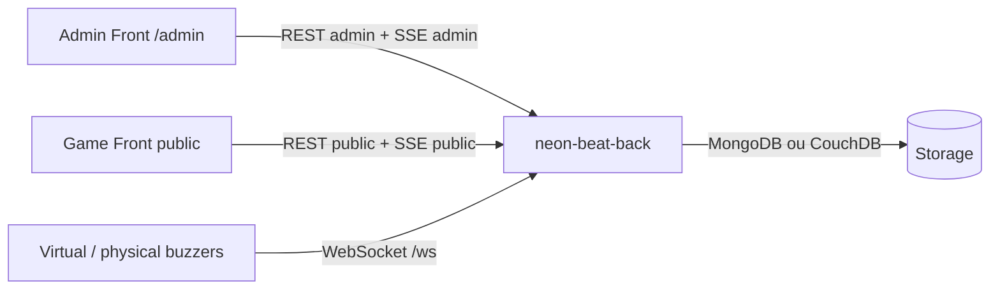

# Resume des microservices Neon Beat

Analyse locale realisee depuis le workspace `tp_k8s`.

## Vue d'ensemble

Neon Beat est une application de blind test / quiz musical temps reel composee de plusieurs depots :

| Dossier | Role | Type | Depot |
|---|---|---|---|
| `neon-beat-back` | API, orchestration de partie, SSE, WebSocket buzzers, persistance | Backend Rust | https://github.com/neon-beat/neon-beat-back.git |
| `neon-beat-admin-front` | Interface d'administration / game master | Frontend React | https://github.com/neon-beat/neon-beat-admin-front.git |
| `neon-beat-game-front` | Affichage public de la partie, questions, scores, blindtest/quiz | Frontend React | https://github.com/neon-beat/neon-beat-game-front.git |
| `neon-beat-virtual-buzzer` | Buzzer web virtuel pour joueurs | Frontend React | https://github.com/neon-beat/neon-beat-virtual-buzzer.git |
| `neon-beat-docs` | Documentation historique et diagrammes PlantUML | Documentation | https://github.com/neon-beat/neon-beat-docs.git |

## Architecture fonctionnelle



Flux principal :

1. L'admin se connecte au backend via `/sse/admin`.
2. Le backend renvoie un token dans l'evenement `handshake`.
3. L'admin utilise ce token dans `X-Admin-Token` pour les routes `/admin/**`.
4. Le public et les buzzers suivent la partie via `/sse/public`.
5. Les buzzers utilisent `/ws` pour `identification` puis `buzz`.
6. Le backend synchronise les phases de jeu, les scores, les equipes, les questions et les patterns LED.

## neon-beat-back

### Role

Backend principal de Neon Beat. Il gere :

- creation, chargement et suppression de parties ;
- import de sequences de questions ;
- phases de jeu : `idle`, `prep_ready`, `prep_pairing`, `playing`, `pause`, `reveal`, `scores` ;
- equipes, scores et association equipe/buzzer ;
- WebSocket des buzzers ;
- SSE pour les interfaces public/admin ;
- persistance MongoDB ou CouchDB.

### Technologies

- Rust 2021
- Axum `0.8`
- Tokio
- Serde / Validator
- Utoipa + Swagger UI
- MongoDB ou CouchDB selon feature Cargo
- Dockerfile multi-stage

### Lancement local

Backend seul :

```bash
cd neon-beat-back
cargo run --release
```

Avec MongoDB :

```bash
cd neon-beat-back
copy docker-compose.mongodb-example.yaml docker-compose.yaml
docker compose up --build
```

Avec CouchDB :

```bash
cd neon-beat-back
copy docker-compose.couchdb-example.yml docker-compose.yaml
docker compose up --build
```

### Variables importantes

| Variable | Defaut | Description |
|---|---:|---|
| `PORT` ou `SERVER_PORT` | `8080` | Port HTTP |
| `NEON_STORE` | requis si MongoDB et CouchDB compiles | `mongo` ou `couch` |
| `MONGO_URI` | `mongodb://localhost:27017` | URI MongoDB |
| `MONGO_DB` | `neon_beat` | Base MongoDB |
| `COUCH_BASE_URL` | - | URL CouchDB |
| `COUCH_DB` | - | Base CouchDB |
| `COUCH_USERNAME` / `COUCH_PASSWORD` | - | Auth CouchDB |
| `NEON_BEAT_BACK_CONFIG_PATH` | `config/app.json` | Couleurs equipes et patterns buzzers |
| `RUST_LOG` | `info` | Niveau de logs |

### Liens et endpoints

| Usage | URL |
|---|---|
| API locale | `http://localhost:8080` |
| Swagger UI locale | `http://localhost:8080/docs` |
| Documentation API publiee | https://neon-beat.github.io/neon-beat-back/ |
| Healthcheck | `GET /healthcheck` |
| SSE public | `GET /sse/public` |
| SSE admin | `GET /sse/admin` |
| WebSocket buzzers | `GET /ws` |

Routes publiques principales :

- `GET /public/teams`
- `GET /public/question`
- `GET /public/phase`
- `GET /public/pairing`

Routes admin principales, protegees par `X-Admin-Token` :

- `GET/POST /admin/games`
- `GET/DELETE /admin/games/{id}`
- `POST /admin/games/{id}/load`
- `GET/POST /admin/questions-sequence`
- `POST /admin/game/start`
- `POST /admin/game/pause`
- `POST /admin/game/resume`
- `POST /admin/game/reveal`
- `POST /admin/game/next`
- `POST /admin/game/stop`
- `POST /admin/game/end`
- `POST /admin/game/question/answer-found`
- `POST /admin/game/question/hint`
- `POST /admin/game/question/submit-validation`
- `POST /admin/teams`
- `PUT/DELETE /admin/teams/{id}`
- `POST /admin/teams/{id}/score`
- `POST /admin/teams/pairing`
- `POST /admin/teams/pairing/abort`

Routes legacy encore presentes :

- `GET/POST /admin/playlists`
- `POST /admin/games/with-playlist`

La documentation indique que ces routes sont depreciees depuis `0.9.0`, au profit de `questions-sequence`.

### Remarques

- Le backend sert une API OpenAPI/Swagger via `/docs`.
- Les SSE publics ne necessitent pas d'authentification.
- Le SSE admin est limite a une connexion et fournit le token admin.
- Le CORS est permissif dans `main.rs`, ce qui simplifie le developpement.
- Le fichier `config/app.json` contient 20 couleurs HSV et les patterns LED `waiting_for_pairing`, `standby`, `playing`, `answering`, `waiting`.
- Le protocole WebSocket backend accepte officiellement deux messages entrants : `identification` et `buzz`.

## neon-beat-admin-front

### Role

Interface de controle pour le game master. Elle permet :

- importer des sequences de questions ;
- creer et charger une partie ;
- gerer les equipes ;
- associer les buzzers aux equipes ;
- demarrer, mettre en pause, reprendre, reveler et terminer une partie ;
- ajuster les scores ;
- valider les reponses ;
- suivre les evenements temps reel via SSE admin.

### Technologies

- React `19`
- TypeScript
- Vite `7`
- Ant Design `5`
- Tailwind CSS `4`
- React Context API
- PWA avec manifest et service worker

### Lancement local

```bash
cd neon-beat-admin-front
npm install
npm run dev
```

Le README indique un serveur Vite sur `http://localhost:5173`.

### Configuration

| Variable | Defaut dans le code | Description |
|---|---|---|
| `VITE_API_BASE_URL` | `http://localhost:8080` | URL du backend |
| `VITE_DEBUG_LEVEL` | non defini | Controle certains messages UI |
| `VITE_DEBUG_GAMESTATE` | non defini | Affichage debug de phase |

Configuration Vite :

- `base: '/admin'`
- build vers `dist/admin`

URL de deploiement attendue :

- `/admin/`

### Liens backend consommes

L'application utilise :

- `GET /healthcheck`
- `GET /sse/admin`
- `GET /public/question`
- `GET /public/teams`
- `GET /public/phase`
- toutes les routes `/admin/**` necessaires au pilotage de la partie.

Le token admin recu via SSE est envoye dans l'en-tete :

```http
X-Admin-Token: <token>
```

### Remarques

- Le service worker reference explicitement `/admin/`.
- L'application est concue pour etre servie sous un sous-chemin `/admin`.
- Le fichier `openapi.json` est present dans le frontend admin, probablement pour reference ou generation.
- Des exemples de playlists JSON sont dans `data/`.

## neon-beat-game-front

### Role

Interface publique affichee aux joueurs/spectateurs. Elle montre :

- ecran d'accueil avec logo et equalizer audio ;
- blindtest avec lecteur YouTube, champs masques/reveles et equipes ;
- quiz QCM ou question ouverte ;
- scores finaux ;
- effets sonores de bonne/mauvaise reponse.

### Technologies

- React `19`
- TypeScript
- Vite `7`
- Tailwind CSS `4`
- Ant Design
- `react-player`
- `r3f-equalizer`
- Vitest / Testing Library

### Lancement local

```bash
cd neon-beat-game-front
npm install
npm run dev
```

### Configuration

| Variable | Defaut dans le code | Description |
|---|---|---|
| `VITE_API_BASE_URL` | `http://localhost:8080` | URL du backend |

Configuration Vite :

- pas de `base` specifique dans `vite.config.ts` ;
- l'application est donc servie a la racine du host Vite par defaut.

### Liens backend consommes

Le hook `useNeonBeatPublic` consomme :

- `GET /public/teams`
- `GET /public/question`
- `GET /public/phase`
- `GET /sse/public`

Evenements SSE geres :

- `phase_changed`
- `team.created`
- `team.updated`
- `team.deleted`
- `pairing.waiting`
- `pairing.assigned`
- `pairing.restored`
- `question.found_answers`
- `question.hints`
- `question.validation`
- `score_adjustment`
- `test.buzz`

### Remarques

- Le README annonce un prototype statique, mais le code actuel est deja branche sur le backend Neon Beat.
- Les questions `blind_test` utilisent une URL YouTube et un demarrage `starts_at_ms`.
- Les questions `multiple_choice` et `open` sont affichees via les composants `Quizz*`.
- Le frontend public ne demande pas d'authentification.

## neon-beat-virtual-buzzer

### Role

Buzzer web virtuel pour remplacer ou simuler un buzzer physique. Il :

- genere un ID buzzer hexadecimal de 12 caracteres ;
- conserve cet ID dans `localStorage` ;
- s'identifie au backend via WebSocket ;
- envoie un `buzz` ;
- ecoute les patterns backend pour animer l'interface ;
- suit les phases et equipes via SSE public ;
- affiche l'equipe associee et son score ;
- permet de changer d'ID tant que le buzzer n'est pas associe a une equipe.

### Technologies

- React `19`
- TypeScript
- Vite `8`
- WebSocket natif navigateur
- EventSource SSE

### Lancement local

```bash
cd neon-beat-virtual-buzzer
npm install
npm run dev
```

### Configuration

| Variable | Defaut dans le code | Description |
|---|---|---|
| `VITE_API_BASE_URL` | chaine vide | URL du backend ou meme origin |

Configuration Vite :

- `base: '/buzzer'`
- build vers `dist/buzzer`

URL de deploiement attendue :

- `/buzzer/`

### Liens backend consommes

- `GET /public/teams`
- `GET /sse/public`
- `GET /ws`

Le WebSocket est derive de `VITE_API_BASE_URL` :

- `http://...` devient `ws://.../ws`
- `https://...` devient `wss://.../ws`

### Remarques

- Si `VITE_API_BASE_URL` est vide, le buzzer appelle `/sse/public`, `/public/teams` et `/ws` sur le meme domaine que le frontend. C'est adapte a un reverse proxy ou ingress qui route aussi le backend.
- Le commentaire dans `App.tsx` mentionne un proxy Vite, mais `vite.config.ts` ne declare pas de proxy. En developpement local, il vaut mieux definir `VITE_API_BASE_URL=http://localhost:8080`.
- Le buzzer virtuel contient une fonction `select(questionId, answerPosition)` qui envoie un message WebSocket `type: "select"` pour QCM. Le backend local ne declare pas ce message dans `BuzzerInboundMessage`; il sera donc ignore/rejete par la validation actuelle. A aligner si la selection QCM par buzzer est souhaitee.

## neon-beat-docs

### Role

Depot de documentation historique. Il contient :

- README de documentation ;
- diagrammes textuels PlantUML dans `internals/*.txt` ;
- diagrammes Markdown/Mermaid comme `internals/game.md` ;
- notes de decisions dans `decisions_records/`.

### Generation des graphes

```bash
cd neon-beat-docs
make
```

Prerequis :

- Java / JRE ;
- Graphviz `dot` ;
- telechargement de `plantuml.jar` via le `Makefile`.

### Remarques

- Ce dossier n'est pas un microservice executable.
- Il est utile pour comprendre les premieres decisions d'architecture et les diagrammes de cycle de jeu.

## Points d'integration

### Communication backend/frontends

| Client | REST | SSE | WebSocket | Auth |
|---|---|---|---|---|
| Admin front | `/admin/**`, `/public/**`, `/healthcheck` | `/sse/admin` | non | token SSE admin |
| Game front | `/public/**` | `/sse/public` | non | non |
| Virtual buzzer | `/public/teams` | `/sse/public` | `/ws` | ID buzzer |

### Phases de jeu partagees

Les frontends s'appuient sur les phases :

- `idle`
- `prep_ready`
- `prep_pairing`
- `playing`
- `pause`
- `reveal`
- `scores`

Attention : certains fichiers frontend admin ont encore `PAIRING: 'pairing'`, alors que le backend et le game front utilisent `prep_pairing`.

### Questions supportees

Types de questions :

- `blind_test`
- `multiple_choice`
- `open`

Le backend persiste des `questions_sequence` reutilisables. Les anciennes routes `playlist` restent presentes mais sont marquees legacy.

## Points d'attention pour Kubernetes

- Le backend doit etre expose avec support WebSocket et SSE sur le meme ingress/service.
- Les frontends Vite ont besoin de `VITE_API_BASE_URL` au build, sauf si un reverse proxy route `/public`, `/admin`, `/sse` et `/ws` vers le backend.
- `neon-beat-admin-front` et `neon-beat-virtual-buzzer` sont concus pour des sous-chemins fixes : `/admin` et `/buzzer`.
- Le `game-front` n'a pas de `base` Vite specifique ; choisir une URL racine ou ajouter une base si necessaire.
- La base de donnees doit etre persistante : PVC MongoDB ou CouchDB.
- Si les deux backends storage sont compiles, `NEON_STORE` est obligatoire.
- L'admin SSE est limite a une seule connexion ; cela peut surprendre si plusieurs admins ouvrent l'interface.
- Les connexions SSE longues doivent avoir des timeouts ingress adaptes.
- Les WebSockets `/ws` doivent etre autorises par l'ingress.

## Commandes utiles

Backend :

```bash
cd neon-beat-back
cargo build --release --bin neon-beat-back
cargo run --release
```

Admin :

```bash
cd neon-beat-admin-front
npm install
npm run dev
npm run build
```

Game front :

```bash
cd neon-beat-game-front
npm install
npm run dev
npm run build
npm test
```

Virtual buzzer :

```bash
cd neon-beat-virtual-buzzer
npm install
npm run dev
npm run build
```

Docs :

```bash
cd neon-beat-docs
make
```
